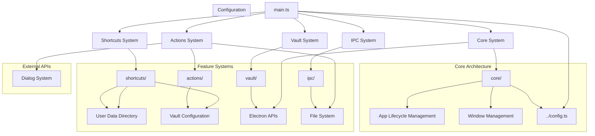
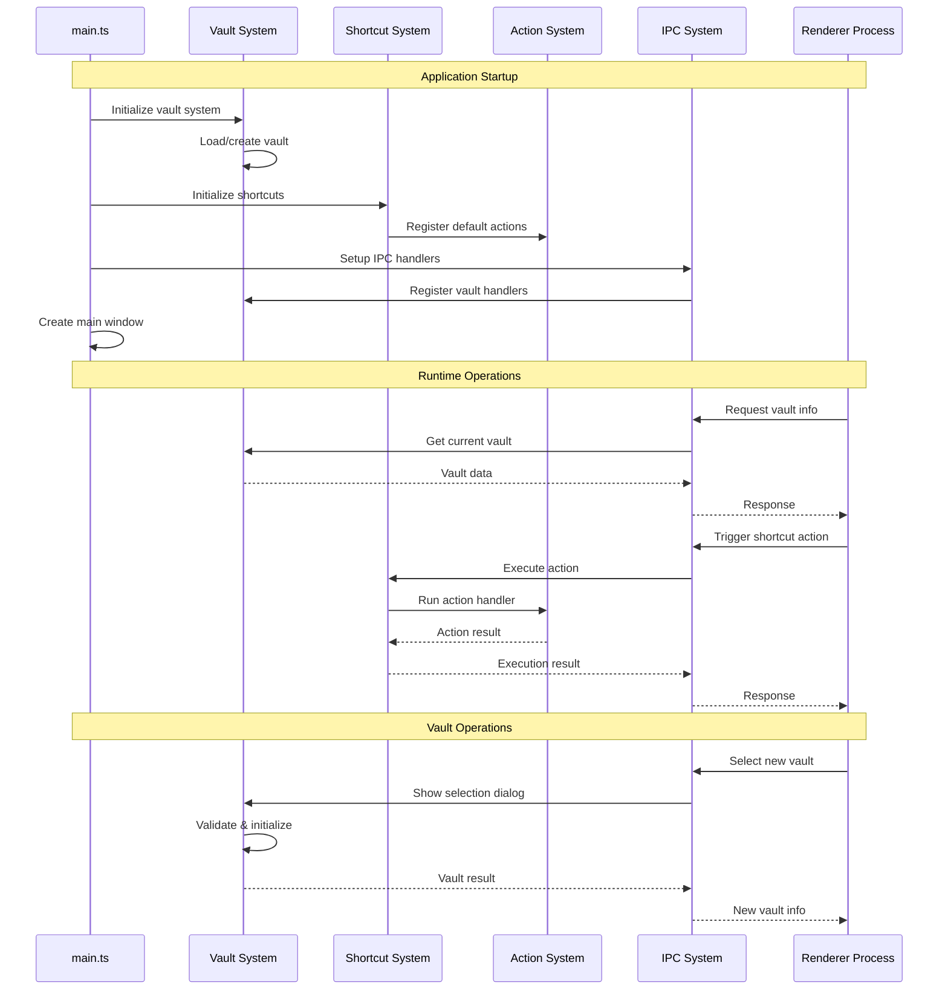

# Electron Main Process

이 디렉토리는 not.e 애플리케이션의 Electron 메인 프로세스를 구현합니다. 모듈화된 아키텍처를 통해 각 기능을 독립적으로 관리하고, 유지보수성과 확장성을 극대화했습니다.

## 전체 아키텍처



## 디렉토리 구조

```
electron/main/
├── main.ts                 # 메인 프로세스 진입점 (12 lines)
├── core/                   # 코어 시스템 아키텍처
│   ├── window/            # 윈도우 관리
│   │   ├── window-manager.ts
│   │   └── index.ts
│   ├── integration/       # 시스템 통합
│   │   ├── system-integrator.ts
│   │   └── index.ts
│   ├── lifecycle/         # 앱 생명주기
│   │   ├── app-lifecycle.ts
│   │   └── index.ts
│   ├── index.ts
│   └── README.md          # 코어 시스템 문서
├── actions/                # 액션 핸들러 시스템
│   ├── file/              # 파일 관련 액션
│   ├── navigation/        # 네비게이션 액션
│   ├── edit/              # 편집 액션
│   ├── view/              # 뷰 제어 액션
│   ├── dev/               # 개발자 도구 액션
│   ├── global/            # 전역 액션
│   ├── index.ts           # 액션 통합 관리
│   └── README.md          # 액션 시스템 문서
├── shortcuts/              # 단축키 관리 시스템
│   ├── types/             # 타입 정의
│   ├── managers/          # 단축키 관리자들
│   ├── actions/           # 액션 실행 관련
│   ├── config/            # 설정 관리
│   ├── index.ts           # 공개 API
│   └── README.md          # 단축키 시스템 문서
├── vault/                  # Vault 관리 시스템
│   ├── types/             # 타입 정의
│   ├── core/              # 팩토리 및 핵심 로직
│   ├── managers/          # Vault 관리자
│   ├── repositories/      # 데이터 접근층
│   ├── services/          # 비즈니스 로직층
│   ├── templates/         # 콘텐츠 템플릿
│   ├── index.ts          # 공개 API
│   └── README.md         # Vault 시스템 문서
├── ipc/                   # IPC 통신 관리
│   ├── types.ts          # IPC 타입 정의
│   ├── core/             # IPC 관리자
│   ├── permissions/      # 권한 관리
│   ├── handlers/         # 기능별 IPC 핸들러
│   ├── index.ts         # IPC 설정 유틸리티
│   └── README.md        # IPC 시스템 문서
└── README.md            # 이 파일
```

## 시스템 간 상호작용



## 주요 구성 요소

### 1. main.ts - 애플리케이션 진입점 (12 lines)

메인 프로세스의 진입점으로, Core 시스템을 통해 모든 초기화를 위임합니다.

```typescript
import { getAppLifecycleManager } from './core'

async function main(): Promise<void> {
  const appLifecycle = getAppLifecycleManager()
  await appLifecycle.initialize()
}

main().catch((error) => {
  console.error('Failed to start application:', error)
  process.exit(1)
})
```

**핵심 책임:**

- 최소한의 진입점 역할
- Core 시스템에 모든 책임 위임
- 전역 에러 핸들링

### 2. Core System (`core/`)

애플리케이션의 핵심 아키텍처를 담당하는 새로운 시스템입니다.

**주요 구성요소:**

- `window/`: 윈도우 생성 및 관리
- `integration/`: 시스템 간 통합 조율
- `lifecycle/`: 애플리케이션 생명주기 관리

**사용 예시:**

```typescript
const appLifecycle = getAppLifecycleManager()
const windowManager = getWindowManager()
const systemIntegrator = getSystemIntegrator()

// 모든 시스템이 분리되어 테스트 가능
```

### 3. Shortcuts System (`shortcuts/`)

전역 및 로컬 단축키를 관리하는 시스템입니다.

**주요 특징:**

- 설정 기반 단축키 관리
- 전역/로컬 단축키 분리
- 액션과의 느슨한 결합
- 런타임 단축키 변경 지원

**사용 예시:**

```typescript
const shortcutManager = getShortcutManager()
await shortcutManager.initialize()
await shortcutManager.setupGlobalShortcuts()
await shortcutManager.setupWindow(window)
```

### 4. Actions System (`actions/`)

단축키와 연결되는 액션 핸들러들을 관리합니다.

**카테고리별 분리:**

- `file/`: 파일 관련 액션
- `navigation/`: 네비게이션 액션
- `edit/`: 편집 관련 액션
- `view/`: 뷰 제어 액션
- `dev/`: 개발자 도구 액션
- `global/`: 전역 액션

**확장 방법:**

```typescript
// 새 액션 카테고리 추가
export function createMyActions(): ShortcutAction[] {
  return [
    {
      name: 'my-action',
      category: 'custom',
      handler: (window) => {
        /* 액션 로직 */
      }
    }
  ]
}
```

### 5. Vault System (`vault/`)

노트 저장소(Vault)를 관리하는 시스템입니다.

**아키텍처 패턴:**

- Repository Pattern: 데이터 접근 추상화
- Service Pattern: 비즈니스 로직 분리
- Factory Pattern: 의존성 주입

**핵심 기능:**

- Vault 선택 및 초기화
- 파일 시스템 관리
- 설정 영구 저장
- 템플릿 기반 구조 생성

### 6. IPC System (`ipc/`)

메인-렌더러 프로세스 간 통신을 관리합니다.

**모듈화 구조:**

- 기능별 핸들러 분리
- 중앙화된 등록/해제 관리
- 컨텍스트 기반 핸들러 지원
- 타입 안전한 통신

## 개발 가이드

### 새로운 시스템 추가

1. **디렉토리 생성**

```bash
mkdir electron/main/my-system
cd electron/main/my-system
```

2. **기본 구조 생성**

```typescript
// types.ts - 타입 정의
export interface MySystemConfig { ... }

// my-system-manager.ts - 메인 관리자
export class MySystemManager { ... }

// index.ts - 공개 API
export { MySystemManager } from './my-system-manager'
export function getMySystemManager() { ... }

// README.md - 시스템 문서
```

3. **main.ts에 통합**

```typescript
import { getMySystemManager } from './my-system'

const mySystemManager = getMySystemManager()

app.whenReady().then(async () => {
  await mySystemManager.initialize()
  // 기타 초기화 로직
})
```

### 기존 시스템 확장

1. **해당 시스템의 README.md 확인**
2. **인터페이스와 타입 정의 검토**
3. **기존 패턴을 따라 구현**
4. **테스트 코드 작성**
5. **README.md 업데이트**

### 코딩 표준

**파일 명명 규칙:**

- 클래스 파일: `kebab-case.ts` (예: `vault-manager.ts`)
- 타입 파일: `types.ts` 또는 `interfaces.ts`
- 인덱스 파일: `index.ts`
- 테스트 파일: `*.test.ts`

**코드 구조:**

- 단일 책임 원칙 준수
- 인터페이스 기반 설계
- 의존성 주입 활용
- 에러 처리 표준화

## 설정 및 데이터

### 설정 파일 위치

```typescript
// Vault 선택 관련 설정 (환경별)
// 프로덕션: userData 디렉토리
const userDataPath = app.getPath('userData')
const vaultSelectionConfig = join(userDataPath, 'vault-selection.json')

// 개발: 프로젝트 루트 .dev-config 디렉토리
const projectRoot = join(__dirname, '../..')
const devVaultSelectionConfig = join(projectRoot, '.dev-config', 'vault-selection.json')

// Vault별 앱 설정 (.not.e 디렉토리)
const vaultAppConfig = join(vaultPath, '.not.e', 'app-config.json')      // 프로덕션
const vaultAppConfigDev = join(vaultPath, '.not.e', 'app-config.dev.json') // 개발
const vaultShortcuts = join(vaultPath, '.not.e', 'shortcuts.json')

// Vault 메타데이터 (.note 디렉토리)
const vaultMetadata = join(vaultPath, '.note', 'vault.json')
const workspacesConfig = join(vaultPath, '.note', 'workspaces.json')
```

### 환경 변수

```typescript
// 개발/프로덕션 모드 감지
export const isDev = process.env.NODE_ENV === 'development' || !process.env.NODE_ENV

// 앱 루트 경로
export const APP_ROOT = join(__dirname, '..')
```

## 빌드 및 개발

### 개발 명령어

```bash
# Electron 빌드
bun run build:electron

# 개발 서버 실행
bun run dev

# 타입 체크
bun run typecheck

# 린트 및 포매팅
bun run lint
bun run lint:fix
```

### 디버깅

```typescript
// 개발 모드에서 DevTools 자동 열기
if (isDev) {
  mainWindow.webContents.openDevTools()
}

// 로깅 시스템
console.log('System initialized:', systemName)
console.error('Error occurred:', error)
```

## 테스팅

### 테스트 구조

```
tests/
├── unit/
│   ├── shortcuts/
│   ├── vault/
│   └── ipc/
├── integration/
└── e2e/
```

### 테스트 예시

```typescript
// Unit test example
describe('VaultManager', () => {
  let vaultManager: VaultManager

  beforeEach(() => {
    vaultManager = new VaultManager()
  })

  test('should initialize vault correctly', async () => {
    await vaultManager.initialize()
    expect(vaultManager.isInitialized()).toBe(true)
  })
})
```

## 보안 고려사항

### 파일 시스템 접근

```typescript
// 경로 검증
function validatePath(path: string): boolean {
  const resolved = resolve(path)
  return !resolved.includes('..')
}

// 권한 확인
async function checkPermissions(path: string): Promise<boolean> {
  try {
    await fs.access(path, fs.constants.R_OK | fs.constants.W_OK)
    return true
  } catch {
    return false
  }
}
```

### IPC 보안

```typescript
// 입력 검증
function validateInput(input: unknown): boolean {
  return typeof input === 'string' && input.length > 0
}

// 권한 기반 접근 제어
async function checkPermission(sender: WebContents, action: string): Promise<boolean> {
  // 권한 검사 로직
  return true
}
```

## 성능 최적화

### 지연 로딩

```typescript
// 필요할 때만 모듈 로드
async function loadHeavyModule() {
  const { HeavyModule } = await import('./heavy-module')
  return new HeavyModule()
}
```

### 메모리 관리

```typescript
// WeakMap 사용으로 메모리 누수 방지
const windowShortcuts = new WeakMap<BrowserWindow, Map<string, string>>()

// 적절한 정리 작업
window.on('closed', () => {
  cleanupResources(window)
})
```

## 문제 해결

### 일반적인 문제들

1. **Vault 선택 다이얼로그가 나타나지 않음**

   - `isDev` 설정 확인
   - 권한 문제 확인
   - 콘솔 에러 로그 확인

2. **단축키가 작동하지 않음**

   - 단축키 등록 순서 확인
   - 액션 핸들러 등록 확인
   - 전역/로컬 단축키 구분 확인

3. **IPC 통신 실패**
   - 핸들러 등록 확인
   - preload 스크립트 설정 확인
   - 채널 이름 일치 확인

### 로그 확인

```bash
# 개발 모드 로그
tail -f ~/.config/not.e/debug.log

# Electron 콘솔 로그
# DevTools 열어서 Console 탭 확인
```

## 향후 계획

### Phase 1 구현 예정

- [ ] 기본 텍스트 편집기
- [ ] 마크다운 지원
- [ ] 워크스페이스 네비게이션
- [ ] 파일 트리 사이드바

### Phase 2 구현 예정

- [ ] 실시간 파일 감시
- [ ] 검색 시스템
- [ ] 태그 관리
- [ ] 내보내기 기능

### Phase 3 구현 예정

- [ ] 플러그인 시스템
- [ ] 브라우저 임베드
- [ ] 고급 테마 시스템
- [ ] Git 통합

## 기여 가이드

1. **코드 변경 전 해당 README 확인**
2. **기존 패턴과 일관성 유지**
3. **타입 안전성 보장**
4. **테스트 코드 작성**
5. **README 업데이트**
6. **커밋 메시지 규칙 준수**

더 자세한 정보는 각 시스템별 README를 참조하세요:

- [Core System](./core/README.md)
- [Shortcuts System](./shortcuts/README.md)
- [Actions System](./actions/README.md)
- [Vault System](./vault/README.md)
- [IPC System](./ipc/README.md)
