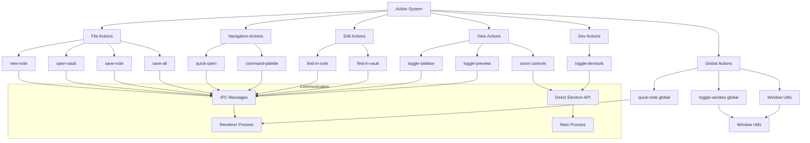
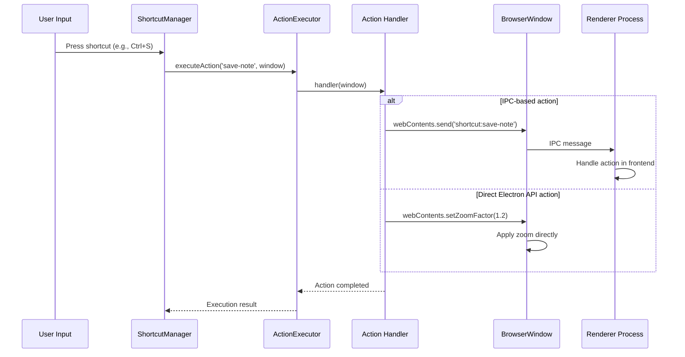

# Action Management System

이 모듈은 not.e 애플리케이션의 액션 핸들러들을 카테고리별로 조직화하고 관리합니다. 각 액션은 단축키 시스템과 연동되어 사용자 입력에 반응합니다.

## 아키텍처 개요



## 액션 카테고리

### 1. File Actions (file/file-actions.ts)

파일 관련 작업을 처리하는 액션들입니다.

```typescript
export function createFileActions(): ShortcutAction[] {
  return [
    {
      name: 'new-note',
      description: 'Create new note',
      category: 'file',
      handler: (window: BrowserWindow | null): void => {
        window?.webContents.send('shortcut:new-note')
      }
    }
    // ... 기타 파일 액션들
  ]
}
```

**포함된 액션들:**

- `new-note`: 새 노트 생성
- `open-vault`: Vault 열기
- `save-note`: 현재 노트 저장
- `save-all`: 모든 노트 저장

### 2. Navigation Actions (navigation/navigation-actions.ts)

앱 내 네비게이션 관련 액션들입니다.

```typescript
export function createNavigationActions(): ShortcutAction[] {
  return [
    {
      name: 'quick-open',
      description: 'Quick open file',
      category: 'navigation',
      handler: (window: BrowserWindow | null): void => {
        window?.webContents.send('shortcut:quick-open')
      }
    }
    // ... 기타 네비게이션 액션들
  ]
}
```

**포함된 액션들:**

- `quick-open`: 빠른 파일 열기
- `command-palette`: 명령 팔레트 열기

### 3. Edit Actions (edit/edit-actions.ts)

편집 관련 액션들입니다.

```typescript
export function createEditActions(): ShortcutAction[] {
  return [
    {
      name: 'find-in-note',
      description: 'Find in current note',
      category: 'edit',
      handler: (window: BrowserWindow | null): void => {
        window?.webContents.send('shortcut:find-in-note')
      }
    }
    // ... 기타 편집 액션들
  ]
}
```

**포함된 액션들:**

- `find-in-note`: 현재 노트에서 찾기
- `find-in-vault`: Vault 전체에서 찾기

### 4. View Actions (view/view-actions.ts)

뷰 및 UI 제어 관련 액션들입니다.

```typescript
export function createViewActions(): ShortcutAction[] {
  return [
    {
      name: 'zoom-in',
      description: 'Zoom in',
      category: 'view',
      handler: (window: BrowserWindow | null): void => {
        const webContents = window?.webContents
        if (webContents) {
          const currentZoom = webContents.getZoomFactor()
          webContents.setZoomFactor(Math.min(currentZoom + 0.1, 3.0))
        }
      }
    }
    // ... 기타 뷰 액션들
  ]
}
```

**포함된 액션들:**

- `toggle-sidebar`: 사이드바 토글
- `toggle-preview`: 미리보기 토글
- `zoom-in`: 확대 (최대 3.0x)
- `zoom-out`: 축소 (최소 0.3x)
- `zoom-reset`: 줌 리셋 (1.0x)

### 5. Dev Actions (dev/dev-actions.ts)

개발자 도구 관련 액션들입니다.

```typescript
export function createDevActions(): ShortcutAction[] {
  return [
    {
      name: 'toggle-devtools',
      description: 'Toggle developer tools',
      category: 'dev',
      handler: (window: BrowserWindow | null): void => {
        window?.webContents.toggleDevTools()
      }
    }
  ]
}
```

**포함된 액션들:**

- `toggle-devtools`: 개발자 도구 토글

### 6. Global Actions (global/global-actions.ts)

전역 단축키로 사용되는 액션들입니다. 새로운 윈도우 모드 시스템을 통해 사용자의 워크플로우에 맞는 유연한 윈도우 관리를 제공합니다.

```typescript
import { 
  findTargetWindow, 
  centerWindowOnCurrentDisplay, 
  showWindowAsSidebar 
} from './window-utils'
import { getWindowMode, getToggleSettings } from './toggle-mode-manager'

export function createGlobalActions(): ShortcutAction[] {
  return [
    {
      name: 'quick-note',
      description: 'Quick note (global)',
      category: 'global',
      handler: (window: BrowserWindow | null): void => {
        const targetWindow = findTargetWindow(window)

        if (targetWindow) {
          if (targetWindow.isMinimized()) targetWindow.restore()
          targetWindow.focus()
          targetWindow.webContents.send('shortcut:quick-note')
        }
      }
    },
    {
      name: 'toggle-window-sidebar',
      description: 'Show/hide window as sidebar',
      category: 'global',
      handler: async (window: BrowserWindow | null): Promise<void> => {
        const windowMode = await getWindowMode()
        if (windowMode !== 'toggle') {
          console.log('Toggle disabled in normal mode')
          return
        }

        const toggleSettings = await getToggleSettings()
        const targetWindow = findTargetWindow(window)
        
        if (targetWindow) {
          if (targetWindow.isVisible() && targetWindow.isFocused()) {
            targetWindow.hide()
          } else {
            showWindowAsSidebar(
              targetWindow, 
              toggleSettings.sidebarPosition || 'right',
              toggleSettings.sidebarWidth || 400
            )
          }
        }
      }
    },
    {
      name: 'toggle-window-standard',
      description: 'Show/hide window (standard behavior)',
      category: 'global',
      handler: async (window: BrowserWindow | null): Promise<void> => {
        const windowMode = await getWindowMode()
        if (windowMode !== 'toggle') {
          console.log('Toggle disabled in normal mode')
          return
        }

        const targetWindow = findTargetWindow(window)
        
        if (targetWindow) {
          if (targetWindow.isVisible() && targetWindow.isFocused()) {
            targetWindow.hide()
          } else {
            if (targetWindow.isMinimized()) targetWindow.restore()
            centerWindowOnCurrentDisplay(targetWindow)
            targetWindow.show()
            targetWindow.focus()
          }
        }
      }
    }
  ]
}
```

**포함된 액션들:**

- `quick-note`: 전역 빠른 노트 (앱을 활성화하고 새 노트 생성)
- `toggle-window-sidebar`: 사이드바 모드 윈도우 토글 (고정 너비로 화면 가장자리에 배치)
- `toggle-window-standard`: 표준 모드 윈도우 토글 (화면 중앙에 기존 크기로 표시)

#### 새로운 윈도우 모드 시스템

| 모드        | 설명                              | 토글 동작                        | 사용 권장 시나리오                 |
| ----------- | --------------------------------- | -------------------------------- | ---------------------------------- |
| **Normal**  | 토글 기능 완전 비활성화           | 없음                             | 전통적인 데스크탑 앱 사용 선호     |
| **Sidebar** | 고정 너비로 화면 가장자리에 배치  | `toggle-window-sidebar` 실행     | 빠른 메모, Raycast/Alfred 스타일   |
| **Standard**| 화면 중앙에 기존 크기로 표시      | `toggle-window-standard` 실행    | 일반적인 토글 사용, 포커스 작업    |

#### 윈도우 모드별 특징

**Normal Mode (일반 모드):**
- 토글 단축키 없음 (깔끔한 인터페이스)
- 전통적인 윈도우 관리 방식
- 다른 앱들과 동일한 사용 경험

**Sidebar Mode (사이드바 모드):**
- 고정 너비 (기본 400px, 사용자 설정 가능)
- 좌측/우측 위치 선택 가능
- 화면 전체 높이 사용
- 빠른 접근을 위한 최적화

**Standard Mode (표준 모드):**
- 기존 윈도우 크기/위치 유지
- 화면 중앙 배치
- 크로스 데스크탑 지원 포함
- 집중적인 작업에 적합

### 6.1. Window Utilities (global/window-utils.ts)

전역 액션에서 사용하는 윈도우 관리 유틸리티 함수들입니다. 새로운 사이드바 모드를 포함한 다양한 윈도우 배치 옵션을 제공합니다.

```typescript
// 유효한 타겟 윈도우 찾기
export function findTargetWindow(window: BrowserWindow | null): BrowserWindow | null

// 현재 커서가 있는 디스플레이의 작업 영역 반환
export function getCurrentWorkArea(): Electron.Display['workArea']

// 현재 디스플레이 기준으로 윈도우 복원
export function restoreWindowOnCurrentDisplay(window: BrowserWindow): void

// 현재 커서가 있는 디스플레이 중앙에 윈도우 배치
export function centerWindowOnCurrentDisplay(window: BrowserWindow): void

// 크로스 데스크탑 모드 윈도우 표시 (현재 데스크탑 + 커서 디스플레이)
export async function showWindow(window: BrowserWindow): Promise<void>

// 사이드바 모드로 윈도우 표시 (새로운 기능)
export function showWindowAsSidebar(
  window: BrowserWindow, 
  position: 'left' | 'right' = 'right', 
  width: number = 400
): void

// 사이드바 위치에 따른 윈도우 경계 계산 (새로운 기능)
export function getSidebarBounds(
  display: Electron.Display, 
  position: 'left' | 'right', 
  width: number
): Electron.Rectangle
```

**유틸리티 함수 설명:**

- `findTargetWindow()`: 주어진 윈도우가 유효하지 않으면 대체 윈도우를 찾음
- `getCurrentWorkArea()`: 마우스 커서가 있는 디스플레이의 작업 영역 정보 반환
- `restoreWindowOnCurrentDisplay()`: 윈도우를 현재 디스플레이 영역 내로 이동/조정
- `centerWindowOnCurrentDisplay()`: 마우스 커서가 있는 디스플레이의 중앙에 윈도우 배치
- `showWindow()`: 크로스 데스크탑 지원 윈도우 표시 (macOS Mission Control 대응)
- `showWindowAsSidebar()`: 윈도우를 사이드바 모드로 배치 (고정 너비, 전체 높이)
- `getSidebarBounds()`: 주어진 디스플레이와 설정에 따른 사이드바 경계 계산

**새로운 사이드바 기능:**

```typescript
// 사이드바 모드 사용 예시
showWindowAsSidebar(window, 'right', 400)  // 우측에 400px 너비로 배치
showWindowAsSidebar(window, 'left', 300)   // 좌측에 300px 너비로 배치

// 사이드바 경계 계산 예시
const display = screen.getDisplayNearestPoint(screen.getCursorScreenPoint())
const bounds = getSidebarBounds(display, 'right', 400)
// Returns: { x: 1520, y: 0, width: 400, height: 1080 } (1920x1080 디스플레이 기준)
```

**크로스 데스크탑 지원 (macOS):**

```typescript
// showWindow()의 크로스 데스크탑 동작 (macOS 전용)
// 1. 현재 마우스 커서 위치 감지
// 2. 해당 디스플레이의 작업 영역 계산
// 3. 윈도우를 숨기고 목표 위치로 이동
// 4. setVisibleOnAllWorkspaces(false) 호출로 현재 데스크탑에 고정
// 5. 100ms 지연 후 윈도우 표시 및 포커스
```

**사용 권장사항:**

- **표준 토글**: `centerWindowOnCurrentDisplay()` + 기본 `show()`/`hide()`
- **크로스 데스크탑 토글**: `showWindow()` + macOS 워크스페이스 관리 로직

### 6.2. Toggle Mode Manager (global/toggle-mode-manager.ts)

새로운 윈도우 모드 시스템의 설정을 관리하는 유틸리티입니다. 세 가지 윈도우 모드와 세부 토글 설정을 제공합니다.

```typescript
// 새로운 윈도우 모드 API
export async function getWindowMode(): Promise<'normal' | 'toggle'>
export async function setWindowMode(mode: 'normal' | 'toggle'): Promise<void>
export async function getToggleSettings(): Promise<ToggleSettings>
export async function setToggleSettings(settings: ToggleSettings): Promise<void>
export async function getAppConfig(): Promise<AppConfig>

// 레거시 API (하위 호환성)
export async function getCrossDesktopToggleEnabled(): Promise<boolean>
export async function setCrossDesktopToggleEnabled(enabled: boolean): Promise<void>
```

**새로운 타입 정의:**

```typescript
interface ToggleSettings {
  toggleType: 'sidebar' | 'standard'
  sidebarPosition?: 'left' | 'right'
  sidebarWidth?: number // pixels, default 400
}

interface AppConfig {
  windowMode: 'normal' | 'toggle'
  toggleSettings?: ToggleSettings
  // ... 기타 설정들
}
```

**기능 설명:**

- `getWindowMode()` / `setWindowMode()`: 현재 윈도우 모드 확인/설정
- `getToggleSettings()` / `setToggleSettings()`: 토글 모드 세부 설정 관리
- `getAppConfig()`: 전체 앱 설정 조회
- 레거시 함수들: 기존 코드와의 호환성 유지

**사용 예시:**

```typescript
import {
  getWindowMode,
  setWindowMode,
  getToggleSettings,
  setToggleSettings
} from '../actions/global/toggle-mode-manager'

// 윈도우 모드 설정
await setWindowMode('toggle')

// 사이드바 토글 설정
await setToggleSettings({
  toggleType: 'sidebar',
  sidebarPosition: 'right',
  sidebarWidth: 350
})

// 현재 설정 확인
const mode = await getWindowMode()
const settings = await getToggleSettings()
console.log(`Window mode: ${mode}`)
console.log(`Toggle type: ${settings.toggleType}`)
```

**설정 마이그레이션:**

기존 `enableCrossDesktopToggle` 설정이 자동으로 새 구조로 마이그레이션됩니다:

```typescript
// 기존 설정: { enableCrossDesktopToggle: true }
// 마이그레이션 후: {
//   windowMode: 'toggle',
//   toggleSettings: {
//     toggleType: 'standard',
//     sidebarPosition: 'right',
//     sidebarWidth: 400
//   }
// }
```

**IPC 통합:**

새로운 IPC API를 통해 프론트엔드에서 완전한 제어가 가능합니다:

```typescript
// 프론트엔드에서 사용
const mode = await window.electronAPI.getWindowMode()
await window.electronAPI.setWindowMode('toggle')

const settings = await window.electronAPI.getToggleSettings()
await window.electronAPI.setToggleSettings({
  toggleType: 'sidebar',
  sidebarPosition: 'left',
  sidebarWidth: 300
})
```

**관련 IPC 핸들러:**

- `get-window-mode` / `set-window-mode` (ROOT): 윈도우 모드 관리
- `get-toggle-settings` / `set-toggle-settings` (ROOT): 토글 설정 관리
- `get-app-config` (ROOT): 전체 설정 조회
- 레거시: `get/set-cross-desktop-toggle-enabled` (하위 호환성)

## 액션 실행 흐름



## 사용 방법

### 기본 사용법

```typescript
import { getAllDefaultActions } from './actions'

// 모든 기본 액션 가져오기
const actions = getAllDefaultActions()

// 카테고리별 액션 가져오기
const fileActions = getActionsByCategory('file')
const viewActions = getActionsByCategory('view')

// 개별 액션 함수들 사용
const fileActions = createFileActions()
const navigationActions = createNavigationActions()
```

### 액션 등록 및 실행

```typescript
// ShortcutManager와 함께 사용
const shortcutManager = getShortcutManager()

// 액션들을 일괄 등록
const actions = getAllDefaultActions()
actions.forEach((action) => {
  shortcutManager.registerAction(action.name, action.handler, action.description, action.category)
})

// 특정 액션 수동 실행
await shortcutManager.executeAction('save-note', window)
```

### 커스텀 액션 추가

```typescript
// 새로운 액션 카테고리 생성
export function createCustomActions(): ShortcutAction[] {
  return [
    {
      name: 'export-pdf',
      description: 'Export current note as PDF',
      category: 'export',
      handler: (window: BrowserWindow | null): void => {
        window?.webContents.send('shortcut:export-pdf')
      }
    },
    {
      name: 'toggle-fullscreen',
      description: 'Toggle fullscreen mode',
      category: 'view',
      handler: (window: BrowserWindow | null): void => {
        if (window) {
          window.setFullScreen(!window.isFullScreen())
        }
      }
    }
  ]
}

// index.ts에서 통합
export function getAllDefaultActions(): ShortcutAction[] {
  return [
    ...createFileActions(),
    ...createNavigationActions(),
    ...createEditActions(),
    ...createViewActions(),
    ...createDevActions(),
    ...createGlobalActions(),
    ...createCustomActions() // 새 액션 추가
  ]
}
```

## IPC 통신 패턴

### Renderer 프로세스에서의 처리

```typescript
// Renderer 프로세스 (SvelteKit)
import { onMount } from 'svelte'

onMount(() => {
  // IPC 리스너 등록
  window.electronAPI?.onShortcut?.('new-note', () => {
    // 새 노트 생성 로직
    createNewNote()
  })

  window.electronAPI?.onShortcut?.('save-note', () => {
    // 노트 저장 로직
    saveCurrentNote()
  })

  window.electronAPI?.onShortcut?.('toggle-sidebar', () => {
    // 사이드바 토글 로직
    sidebarVisible = !sidebarVisible
  })
})
```

### Preload 스크립트 확장

```typescript
// preload.ts에 추가
export interface ElectronAPI {
  // ... 기존 API
  onShortcut: (action: string, callback: () => void) => void
  removeShortcutListener: (action: string) => void
}

const electronAPI: ElectronAPI = {
  // ... 기존 구현
  onShortcut: (action: string, callback: () => void) => {
    ipcRenderer.on(`shortcut:${action}`, callback)
  },
  removeShortcutListener: (action: string) => {
    ipcRenderer.removeAllListeners(`shortcut:${action}`)
  }
}
```

## 액션 타입 정의

```typescript
// 액션 핸들러 타입
export type ShortcutActionHandler = (window: BrowserWindow | null) => void | Promise<void>

// 액션 인터페이스
export interface ShortcutAction {
  name: string // 고유 액션 이름
  handler: ShortcutActionHandler // 실행할 핸들러 함수
  description: string // 사용자에게 표시될 설명
  category: string // 액션 카테고리
}

// 액션 카테고리 타입
export type ActionCategory = 'file' | 'navigation' | 'edit' | 'view' | 'dev' | 'global' | string // 커스텀 카테고리 허용
```

## 확장 가이드

### 새로운 액션 추가 단계

1. **액션 함수 정의**

```typescript
// actions/custom/custom-actions.ts
export function createCustomActions(): ShortcutAction[] {
  return [
    {
      name: 'my-action',
      description: 'My custom action',
      category: 'custom',
      handler: (window: BrowserWindow | null): void => {
        // 액션 로직 구현
      }
    }
  ]
}

// actions/custom/index.ts
export { createCustomActions } from './custom-actions'
```

2. **index.ts에 통합**

```typescript
// actions/index.ts
import { createCustomActions } from './custom'

export function getAllDefaultActions(): ShortcutAction[] {
  return [
    // ... 기존 액션들
    ...createCustomActions()
  ]
}
```

3. **설정에 단축키 추가**

```typescript
// shortcuts/config-manager.ts의 createDefaultConfig()에 추가
{
  key: 'CmdOrCtrl+M',
  action: 'my-action',
  description: 'My custom action',
  category: 'custom'
}
```

4. **Renderer에서 처리**

```typescript
// Renderer 프로세스
window.electronAPI?.onShortcut?.('my-action', () => {
  // 프론트엔드 액션 처리
})
```

### 비동기 액션 처리

```typescript
{
  name: 'async-action',
  description: 'Async action example',
  category: 'custom',
  handler: async (window: BrowserWindow | null): Promise<void> => {
    try {
      // 비동기 작업 수행
      const result = await someAsyncOperation()
      window?.webContents.send('shortcut:async-action', result)
    } catch (error) {
      console.error('Async action failed:', error)
      window?.webContents.send('shortcut:action-error', error.message)
    }
  }
}
```

### 조건부 액션 실행

```typescript
{
  name: 'conditional-action',
  description: 'Conditional action',
  category: 'custom',
  handler: (window: BrowserWindow | null): void => {
    if (!window) {
      console.log('No active window')
      return
    }

    // 윈도우 상태 확인
    if (window.isMinimized()) {
      window.restore()
    }

    // 조건에 따른 다른 동작
    if (window.isFocused()) {
      window.webContents.send('shortcut:focused-action')
    } else {
      window.webContents.send('shortcut:unfocused-action')
    }
  }
}
```

### Window Utils 활용하기

전역 액션이나 윈도우 관리가 필요한 액션에서는 window-utils의 헬퍼 함수들을 활용하세요:

```typescript
import { findTargetWindow, showWindow, centerWindowOnCurrentDisplay } from '../global/window-utils'

{
  name: 'custom-window-action',
  description: 'Custom window management action',
  category: 'custom',
  handler: (window: BrowserWindow | null): void => {
    const targetWindow = findTargetWindow(window)

    if (targetWindow) {
      // 단순히 윈도우 표시
      showWindow(targetWindow)

      // 또는 현재 디스플레이로만 이동
      centerWindowOnCurrentDisplay(targetWindow)

      // 커스텀 로직 추가
      targetWindow.webContents.send('custom-action')
    }
  }
}
```

**Window Utils 사용 시나리오:**

1. **전역 액션**: `findTargetWindow()`로 유효한 윈도우 찾기
2. **다중 디스플레이**: `centerWindowOnCurrentDisplay()`로 현재 디스플레이에 배치
3. **윈도우 복원**: `showWindow()`로 최소화된 윈도우도 적절히 표시
4. **토글 기능**: `toggleWindowVisibility()`로 스마트한 표시/숨김

## 모범 사례

1. **명명 규칙**: 액션 이름은 `kebab-case`로 작성
2. **카테고리 일관성**: 관련된 액션들은 같은 카테고리로 그룹화
3. **에러 처리**: 모든 핸들러에서 적절한 에러 처리 구현
4. **타입 안전성**: TypeScript 타입을 활용하여 컴파일 타임 검증
5. **문서화**: 새로운 액션 추가 시 description을 명확하게 작성
6. **윈도우 관리**: 윈도우 조작이 필요한 경우 window-utils의 헬퍼 함수 활용
7. **코드 재사용**: 공통 로직은 별도 유틸리티 함수로 분리하여 재사용성 향상
