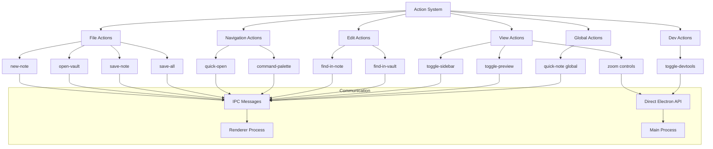
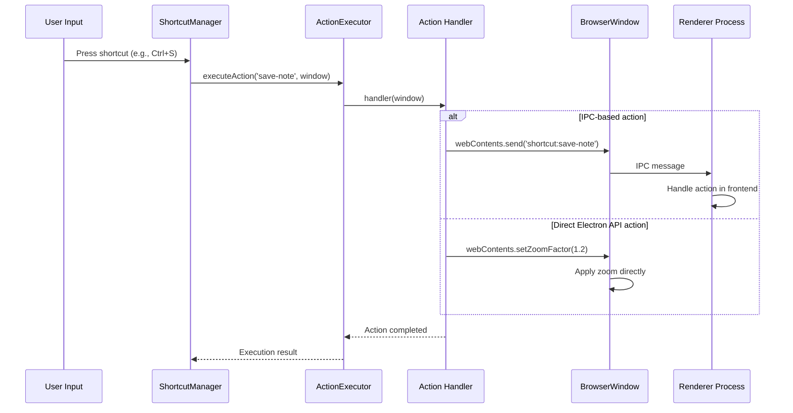

# Action Management System

이 모듈은 not.e 애플리케이션의 액션 핸들러들을 카테고리별로 조직화하고 관리합니다. 각 액션은 단축키 시스템과 연동되어 사용자 입력에 반응합니다.

## 아키텍처 개요



## 액션 카테고리

### 1. File Actions (file/file-actions.ts)

파일 관련 작업을 처리하는 액션들입니다.

```typescript
export function createFileActions(): ShortcutAction[] {
  return [
    {
      name: 'new-note',
      description: 'Create new note',
      category: 'file',
      handler: (window: BrowserWindow | null): void => {
        window?.webContents.send('shortcut:new-note')
      }
    }
    // ... 기타 파일 액션들
  ]
}
```

**포함된 액션들:**

- `new-note`: 새 노트 생성
- `open-vault`: Vault 열기
- `save-note`: 현재 노트 저장
- `save-all`: 모든 노트 저장

### 2. Navigation Actions (navigation/navigation-actions.ts)

앱 내 네비게이션 관련 액션들입니다.

```typescript
export function createNavigationActions(): ShortcutAction[] {
  return [
    {
      name: 'quick-open',
      description: 'Quick open file',
      category: 'navigation',
      handler: (window: BrowserWindow | null): void => {
        window?.webContents.send('shortcut:quick-open')
      }
    }
    // ... 기타 네비게이션 액션들
  ]
}
```

**포함된 액션들:**

- `quick-open`: 빠른 파일 열기
- `command-palette`: 명령 팔레트 열기

### 3. Edit Actions (edit/edit-actions.ts)

편집 관련 액션들입니다.

```typescript
export function createEditActions(): ShortcutAction[] {
  return [
    {
      name: 'find-in-note',
      description: 'Find in current note',
      category: 'edit',
      handler: (window: BrowserWindow | null): void => {
        window?.webContents.send('shortcut:find-in-note')
      }
    }
    // ... 기타 편집 액션들
  ]
}
```

**포함된 액션들:**

- `find-in-note`: 현재 노트에서 찾기
- `find-in-vault`: Vault 전체에서 찾기

### 4. View Actions (view/view-actions.ts)

뷰 및 UI 제어 관련 액션들입니다.

```typescript
export function createViewActions(): ShortcutAction[] {
  return [
    {
      name: 'zoom-in',
      description: 'Zoom in',
      category: 'view',
      handler: (window: BrowserWindow | null): void => {
        const webContents = window?.webContents
        if (webContents) {
          const currentZoom = webContents.getZoomFactor()
          webContents.setZoomFactor(Math.min(currentZoom + 0.1, 3.0))
        }
      }
    }
    // ... 기타 뷰 액션들
  ]
}
```

**포함된 액션들:**

- `toggle-sidebar`: 사이드바 토글
- `toggle-preview`: 미리보기 토글
- `zoom-in`: 확대 (최대 3.0x)
- `zoom-out`: 축소 (최소 0.3x)
- `zoom-reset`: 줌 리셋 (1.0x)

### 5. Dev Actions (dev/dev-actions.ts)

개발자 도구 관련 액션들입니다.

```typescript
export function createDevActions(): ShortcutAction[] {
  return [
    {
      name: 'toggle-devtools',
      description: 'Toggle developer tools',
      category: 'dev',
      handler: (window: BrowserWindow | null): void => {
        window?.webContents.toggleDevTools()
      }
    }
  ]
}
```

**포함된 액션들:**

- `toggle-devtools`: 개발자 도구 토글

### 6. Global Actions (global-actions.ts)

전역 단축키로 사용되는 액션들입니다.

```typescript
export function createGlobalActions(): ShortcutAction[] {
  return [
    {
      name: 'quick-note',
      description: 'Quick note (global)',
      category: 'global',
      handler: (window: BrowserWindow | null): void => {
        let targetWindow = window

        if (!targetWindow) {
          const allWindows = BrowserWindow.getAllWindows()
          targetWindow = allWindows.find((w) => !w.isDestroyed()) || null
        }

        if (targetWindow) {
          if (targetWindow.isMinimized()) targetWindow.restore()
          targetWindow.focus()
          targetWindow.webContents.send('shortcut:quick-note')
        }
      }
    }
  ]
}
```

**포함된 액션들:**

- `quick-note`: 전역 빠른 노트 (앱을 활성화하고 새 노트 생성)

## 액션 실행 흐름



## 사용 방법

### 기본 사용법

```typescript
import { getAllDefaultActions } from './actions'

// 모든 기본 액션 가져오기
const actions = getAllDefaultActions()

// 카테고리별 액션 가져오기
const fileActions = getActionsByCategory('file')
const viewActions = getActionsByCategory('view')

// 개별 액션 함수들 사용
const fileActions = createFileActions()
const navigationActions = createNavigationActions()
```

### 액션 등록 및 실행

```typescript
// ShortcutManager와 함께 사용
const shortcutManager = getShortcutManager()

// 액션들을 일괄 등록
const actions = getAllDefaultActions()
actions.forEach((action) => {
  shortcutManager.registerAction(action.name, action.handler, action.description, action.category)
})

// 특정 액션 수동 실행
await shortcutManager.executeAction('save-note', window)
```

### 커스텀 액션 추가

```typescript
// 새로운 액션 카테고리 생성
export function createCustomActions(): ShortcutAction[] {
  return [
    {
      name: 'export-pdf',
      description: 'Export current note as PDF',
      category: 'export',
      handler: (window: BrowserWindow | null): void => {
        window?.webContents.send('shortcut:export-pdf')
      }
    },
    {
      name: 'toggle-fullscreen',
      description: 'Toggle fullscreen mode',
      category: 'view',
      handler: (window: BrowserWindow | null): void => {
        if (window) {
          window.setFullScreen(!window.isFullScreen())
        }
      }
    }
  ]
}

// index.ts에서 통합
export function getAllDefaultActions(): ShortcutAction[] {
  return [
    ...createFileActions(),
    ...createNavigationActions(),
    ...createEditActions(),
    ...createViewActions(),
    ...createDevActions(),
    ...createGlobalActions(),
    ...createCustomActions() // 새 액션 추가
  ]
}
```

## IPC 통신 패턴

### Renderer 프로세스에서의 처리

```typescript
// Renderer 프로세스 (SvelteKit)
import { onMount } from 'svelte'

onMount(() => {
  // IPC 리스너 등록
  window.electronAPI?.onShortcut?.('new-note', () => {
    // 새 노트 생성 로직
    createNewNote()
  })

  window.electronAPI?.onShortcut?.('save-note', () => {
    // 노트 저장 로직
    saveCurrentNote()
  })

  window.electronAPI?.onShortcut?.('toggle-sidebar', () => {
    // 사이드바 토글 로직
    sidebarVisible = !sidebarVisible
  })
})
```

### Preload 스크립트 확장

```typescript
// preload.ts에 추가
export interface ElectronAPI {
  // ... 기존 API
  onShortcut: (action: string, callback: () => void) => void
  removeShortcutListener: (action: string) => void
}

const electronAPI: ElectronAPI = {
  // ... 기존 구현
  onShortcut: (action: string, callback: () => void) => {
    ipcRenderer.on(`shortcut:${action}`, callback)
  },
  removeShortcutListener: (action: string) => {
    ipcRenderer.removeAllListeners(`shortcut:${action}`)
  }
}
```

## 액션 타입 정의

```typescript
// 액션 핸들러 타입
export type ShortcutActionHandler = (window: BrowserWindow | null) => void | Promise<void>

// 액션 인터페이스
export interface ShortcutAction {
  name: string // 고유 액션 이름
  handler: ShortcutActionHandler // 실행할 핸들러 함수
  description: string // 사용자에게 표시될 설명
  category: string // 액션 카테고리
}

// 액션 카테고리 타입
export type ActionCategory = 'file' | 'navigation' | 'edit' | 'view' | 'dev' | 'global' | string // 커스텀 카테고리 허용
```

## 확장 가이드

### 새로운 액션 추가 단계

1. **액션 함수 정의**

```typescript
// actions/custom/custom-actions.ts
export function createCustomActions(): ShortcutAction[] {
  return [
    {
      name: 'my-action',
      description: 'My custom action',
      category: 'custom',
      handler: (window: BrowserWindow | null): void => {
        // 액션 로직 구현
      }
    }
  ]
}

// actions/custom/index.ts
export { createCustomActions } from './custom-actions'
```

2. **index.ts에 통합**

```typescript
// actions/index.ts
import { createCustomActions } from './custom'

export function getAllDefaultActions(): ShortcutAction[] {
  return [
    // ... 기존 액션들
    ...createCustomActions()
  ]
}
```

3. **설정에 단축키 추가**

```typescript
// shortcuts/config-manager.ts의 createDefaultConfig()에 추가
{
  key: 'CmdOrCtrl+M',
  action: 'my-action',
  description: 'My custom action',
  category: 'custom'
}
```

4. **Renderer에서 처리**

```typescript
// Renderer 프로세스
window.electronAPI?.onShortcut?.('my-action', () => {
  // 프론트엔드 액션 처리
})
```

### 비동기 액션 처리

```typescript
{
  name: 'async-action',
  description: 'Async action example',
  category: 'custom',
  handler: async (window: BrowserWindow | null): Promise<void> => {
    try {
      // 비동기 작업 수행
      const result = await someAsyncOperation()
      window?.webContents.send('shortcut:async-action', result)
    } catch (error) {
      console.error('Async action failed:', error)
      window?.webContents.send('shortcut:action-error', error.message)
    }
  }
}
```

### 조건부 액션 실행

```typescript
{
  name: 'conditional-action',
  description: 'Conditional action',
  category: 'custom',
  handler: (window: BrowserWindow | null): void => {
    if (!window) {
      console.log('No active window')
      return
    }

    // 윈도우 상태 확인
    if (window.isMinimized()) {
      window.restore()
    }

    // 조건에 따른 다른 동작
    if (window.isFocused()) {
      window.webContents.send('shortcut:focused-action')
    } else {
      window.webContents.send('shortcut:unfocused-action')
    }
  }
}
```

## 모범 사례

1. **명명 규칙**: 액션 이름은 `kebab-case`로 작성
2. **카테고리 일관성**: 관련된 액션들은 같은 카테고리로 그룹화
3. **에러 처리**: 모든 핸들러에서 적절한 에러 처리 구현
4. **타입 안전성**: TypeScript 타입을 활용하여 컴파일 타임 검증
5. **문서화**: 새로운 액션 추가 시 description을 명확하게 작성
