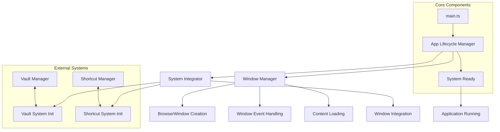
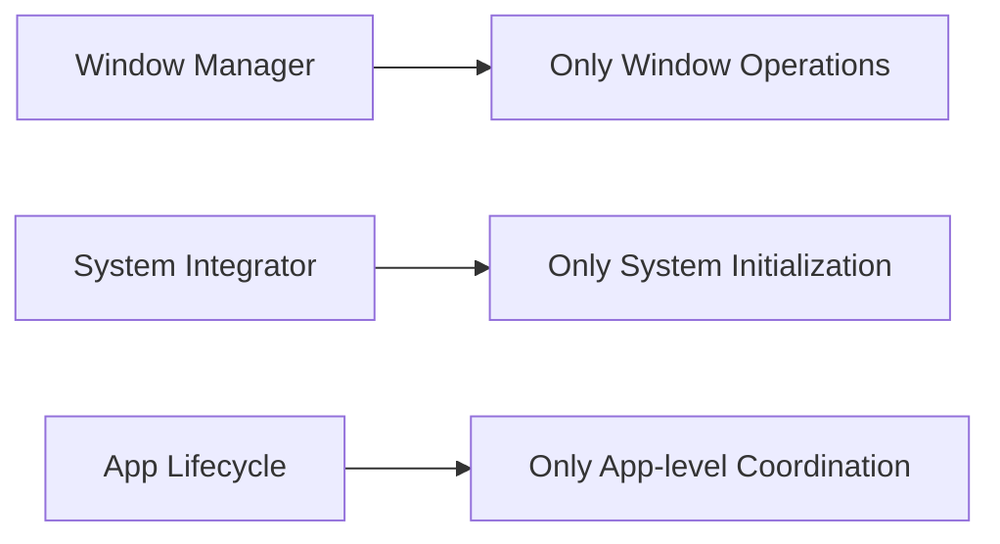
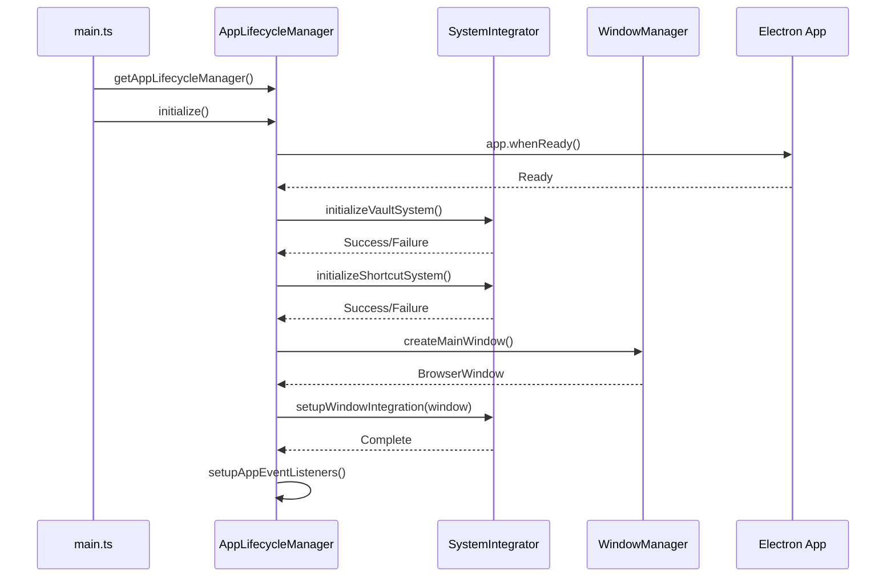

# Core System Architecture

이 모듈은 not.e 애플리케이션의 핵심 시스템 아키텍처를 담당합니다. 애플리케이션 생명주기 관리, 윈도우 관리, 시스템 통합을 체계적으로 분리하여 관리합니다.

## 아키텍처 개요



## 모듈 구조

### 1. Window Management (window/)

윈도우 생성, 설정, 이벤트 처리를 담당합니다.

```typescript
// window/window-manager.ts
export interface WindowManager {
  createMainWindow(config?: WindowConfig): BrowserWindow
  getMainWindow(): BrowserWindow | null
  setMainWindow(window: BrowserWindow | null): void
}

export class DefaultWindowManager implements WindowManager {
  private mainWindow: BrowserWindow | null = null

  createMainWindow(config: WindowConfig = {}): BrowserWindow {
    // 윈도우 생성 및 설정
    this.mainWindow = new BrowserWindow({
      width: config.width || 1200,
      height: config.height || 800,
      webPreferences: {
        nodeIntegration: false,
        contextIsolation: true,
        preload: join(__dirname, '../../preload/preload.js')
      },
      titleBarStyle: process.platform === 'darwin' ? 'hiddenInset' : 'default'
    })

    this.setupWindowEvents()
    this.loadContent()

    return this.mainWindow
  }
}
```

**주요 기능:**

- 플랫폼별 윈도우 설정 (macOS: hiddenInset titleBar)
- 보안 설정 (contextIsolation, preload)
- 개발/프로덕션 환경별 콘텐츠 로딩
- 윈도우 이벤트 처리 (ready-to-show, closed)
- 싱글톤 패턴으로 전역 접근

### 2. System Integration (integration/)

외부 시스템들의 초기화와 통합을 관리합니다.

```typescript
// integration/system-integrator.ts
export interface SystemIntegrator {
  initializeVaultSystem(): Promise<InitializationResult>
  initializeShortcutSystem(): Promise<InitializationResult>
  setupWindowIntegration(window: BrowserWindow): Promise<void>
}

export class DefaultSystemIntegrator implements SystemIntegrator {
  async initializeVaultSystem(): Promise<InitializationResult> {
    try {
      const vaultManager = getVaultManager()
      await vaultManager.initialize()
      return { success: true }
    } catch (error) {
      return { success: false, error: error.message }
    }
  }

  async initializeShortcutSystem(): Promise<InitializationResult> {
    try {
      const shortcutManager = getShortcutManager()
      await shortcutManager.initialize()
      return { success: true }
    } catch (error) {
      return { success: false, error: error.message }
    }
  }
}
```

**주요 기능:**

- Vault 시스템 초기화 및 에러 처리
- 단축키 시스템 초기화 (실패 시 앱 계속 실행)
- 윈도우-시스템 간 통합 설정
- 초기화 결과 반환으로 체계적 에러 관리

### 3. Application Lifecycle (lifecycle/)

애플리케이션의 전체 생명주기를 관리합니다.

```typescript
// lifecycle/app-lifecycle.ts
export interface AppLifecycleManager {
  initialize(): Promise<void>
  createMainWindow(config?: WindowConfig): Promise<BrowserWindow>
  handleActivation(): void
  handleWindowsClosed(): void
}

export class DefaultAppLifecycleManager implements AppLifecycleManager {
  private windowManager = getWindowManager()
  private systemIntegrator = getSystemIntegrator()

  async initialize(): Promise<void> {
    await app.whenReady()

    // 시스템 초기화
    await this.initializeSystems()

    // 메인 윈도우 생성
    await this.createMainWindow()

    // 앱 이벤트 리스너 등록
    this.setupAppEventListeners()
  }

  private async initializeSystems(): Promise<void> {
    // Vault 시스템 초기화 (실패 시 앱 종료)
    const vaultResult = await this.systemIntegrator.initializeVaultSystem()
    if (!vaultResult.success) {
      console.error('Vault initialization failed:', vaultResult.error)
      app.quit()
      return
    }

    // 단축키 시스템 초기화 (실패해도 계속)
    const shortcutResult = await this.systemIntegrator.initializeShortcutSystem()
    if (!shortcutResult.success) {
      console.error('Shortcut system initialization failed:', shortcutResult.error)
    }
  }
}
```

**주요 기능:**

- Electron app.whenReady() 처리
- 시스템 초기화 순서 관리
- 메인 윈도우 생성 및 통합
- 플랫폼별 앱 이벤트 처리 (activate, window-all-closed)
- 초기화 실패 시 적절한 에러 처리

## 주요 설계 원칙

### 1. Separation of Concerns (관심사의 분리)



각 컴포넌트는 명확히 정의된 책임만을 가집니다:

- **WindowManager**: 윈도우 생성/관리만
- **SystemIntegrator**: 시스템 초기화만
- **AppLifecycleManager**: 전체 흐름 조정만

### 2. Dependency Injection

```typescript
export class DefaultAppLifecycleManager implements AppLifecycleManager {
  private windowManager = getWindowManager() // 의존성 주입
  private systemIntegrator = getSystemIntegrator() // 의존성 주입

  // 테스트 시 모킹 가능한 구조
}
```

### 3. Interface-Based Design

모든 주요 컴포넌트는 인터페이스를 통해 정의되어 테스트 가능성과 확장성을 보장합니다.

### 4. Singleton with Reset

```typescript
// 싱글톤 패턴 + 테스트용 리셋 함수
let windowManagerInstance: WindowManager | null = null

export function getWindowManager(): WindowManager {
  if (!windowManagerInstance) {
    windowManagerInstance = new DefaultWindowManager()
  }
  return windowManagerInstance
}

export function resetWindowManager(): void {
  windowManagerInstance = null
}
```

## 실행 흐름

### 애플리케이션 시작 순서



### 에러 처리 전략

1. **Vault 초기화 실패**: 앱 종료 (필수 시스템)
2. **단축키 초기화 실패**: 경고 로그, 앱 계속 실행
3. **윈도우 생성 실패**: 에러 로그, 재시도 가능

## 사용 방법

### 기본 사용법

```typescript
// main.ts
import { getAppLifecycleManager } from './core'

async function main(): Promise<void> {
  const appLifecycle = getAppLifecycleManager()
  await appLifecycle.initialize()
}

main().catch((error) => {
  console.error('Failed to start application:', error)
  process.exit(1)
})
```

### 커스텀 윈도우 설정

```typescript
// 커스텀 윈도우 설정으로 생성
const appLifecycle = getAppLifecycleManager()
await appLifecycle.createMainWindow({
  width: 1400,
  height: 900,
  minWidth: 1200,
  minHeight: 700,
  show: true
})
```

### 시스템 통합 커스터마이징

```typescript
// 커스텀 시스템 통합자 구현
export class CustomSystemIntegrator implements SystemIntegrator {
  async initializeVaultSystem(): Promise<InitializationResult> {
    // 커스텀 Vault 초기화 로직
    return { success: true }
  }

  async initializeShortcutSystem(): Promise<InitializationResult> {
    // 커스텀 단축키 시스템 초기화
    return { success: true }
  }

  async setupWindowIntegration(window: BrowserWindow): Promise<void> {
    // 커스텀 윈도우 통합 로직
  }
}
```

## 테스트 지원

### 모킹 가능한 구조

```typescript
// 테스트에서 의존성 모킹
jest.mock('./window/window-manager', () => ({
  getWindowManager: jest.fn(() => mockWindowManager)
}))

jest.mock('./integration/system-integrator', () => ({
  getSystemIntegrator: jest.fn(() => mockSystemIntegrator)
}))
```

### 리셋 함수 활용

```typescript
// 테스트 간 상태 초기화
afterEach(() => {
  resetWindowManager()
  resetSystemIntegrator()
  resetAppLifecycleManager()
})
```

## 확장 가이드

### 새로운 시스템 통합 추가

1. **SystemIntegrator에 메서드 추가**

```typescript
export interface SystemIntegrator {
  // 기존 메서드들...
  initializePluginSystem(): Promise<InitializationResult>
}
```

2. **AppLifecycleManager에서 호출**

```typescript
private async initializeSystems(): Promise<void> {
  // 기존 초기화...

  // 플러그인 시스템 초기화
  const pluginResult = await this.systemIntegrator.initializePluginSystem()
  if (!pluginResult.success) {
    console.error('Plugin system initialization failed:', pluginResult.error)
  }
}
```

### 윈도우 타입 확장

```typescript
export interface WindowManager {
  // 기존 메서드들...
  createPluginWindow(): BrowserWindow
  createSettingsWindow(): BrowserWindow
}
```

## 모범 사례

1. **에러 처리**: 모든 초기화 작업에 적절한 에러 처리
2. **로깅**: 시스템 상태 변화를 명확히 로깅
3. **타입 안전성**: TypeScript 인터페이스 활용
4. **테스트 가능성**: 의존성 주입과 모킹 지원
5. **플랫폼 고려**: macOS 우선, 향후 크로스 플랫폼 확장 고려
