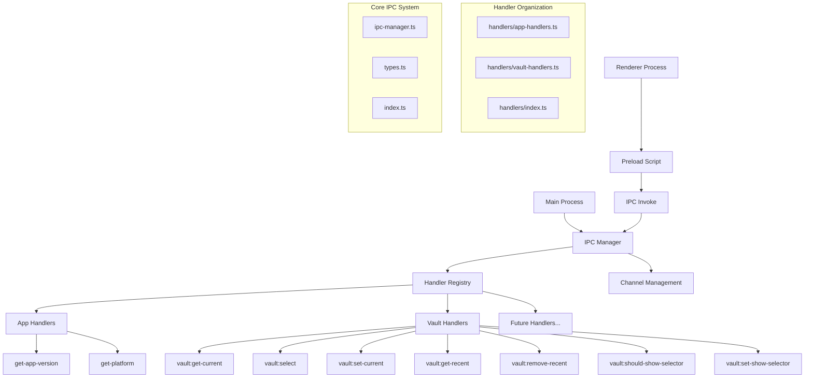

# IPC Management System

이 모듈은 not.e 애플리케이션의 IPC(Inter-Process Communication) 관리 시스템을 구현합니다. 메인 프로세스와 렌더러 프로세스 간의 통신을 체계적으로 관리하고, 기능별로 핸들러를 분리하여 유지보수성을 높였습니다.

## 아키텍처 개요



## 핵심 컴포넌트

### 1. IPC Manager (ipc-manager.ts)
IPC 핸들러의 등록, 해제, 관리를 담당하는 중앙 관리자입니다.

```typescript
import { DefaultIPCManager } from './ipc-manager'

const ipcManager = new DefaultIPCManager()

// 개별 핸들러 등록
ipcManager.registerHandler({
  channel: 'my-channel',
  handler: (event, ...args) => {
    // 핸들러 로직
    return 'response'
  }
})

// 다중 핸들러 등록
ipcManager.registerHandlers([
  { channel: 'channel1', handler: handler1 },
  { channel: 'channel2', handler: handler2 }
])

// 핸들러 해제
ipcManager.unregisterHandler('my-channel')

// 모든 핸들러 해제
ipcManager.unregisterAll()
```

**주요 기능:**
- 중복 등록 방지
- 등록된 채널 추적
- 일괄 등록/해제
- 디버깅을 위한 로깅

### 2. Handler Organization (handlers/)
기능별로 분리된 IPC 핸들러들입니다.

#### App Handlers (handlers/app-handlers.ts)
애플리케이션 기본 정보 관련 핸들러들입니다.

```typescript
export function createAppHandlers(): IPCHandler[] {
  return [
    {
      channel: 'get-app-version',
      handler: (): string => {
        return app.getVersion()
      }
    },
    {
      channel: 'get-platform',
      handler: (): NodeJS.Platform => {
        return process.platform
      }
    }
  ]
}
```

#### Vault Handlers (handlers/vault-handlers.ts)
Vault 관리 관련 IPC 핸들러들입니다.

```typescript
export function createVaultHandlers(context: IPCContext): IPCHandler[] {
  const vaultManager = getVaultManager()

  return [
    {
      channel: 'vault:get-current',
      handler: async () => {
        return await vaultManager.getCurrentVault()
      }
    },
    {
      channel: 'vault:select',
      handler: async () => {
        return await vaultManager.showVaultSelectionDialog(context.mainWindow || undefined)
      }
    }
    // ... 기타 vault 핸들러들
  ]
}
```

### 3. Type System (types.ts)
IPC 시스템의 타입 정의입니다.

```typescript
export interface IPCHandler {
  channel: string
  handler: (event: Electron.IpcMainInvokeEvent, ...args: any[]) => any
}

export interface IPCManager {
  registerHandler(handler: IPCHandler): void
  registerHandlers(handlers: IPCHandler[]): void
  unregisterHandler(channel: string): void
  unregisterAll(): void
}

export interface IPCContext {
  mainWindow: BrowserWindow | null
}
```

## 데이터 흐름

### IPC 통신 플로우


### Handler Registration Flow


## 사용 방법

### 기본 설정

```typescript
// main.ts에서 IPC 설정
import { setupIPCHandlers } from './ipc'

function createWindow() {
  const mainWindow = new BrowserWindow({...})
  
  // 윈도우 생성 후 IPC 핸들러 설정
  setupIPCHandlers({ mainWindow })
}
```

### 새로운 핸들러 추가

#### 1. 새로운 핸들러 파일 생성

```typescript
// handlers/workspace-handlers.ts
import { IPCHandler, IPCContext } from '../types'
import { getWorkspaceManager } from '../../workspace'

export function createWorkspaceHandlers(context: IPCContext): IPCHandler[] {
  const workspaceManager = getWorkspaceManager()

  return [
    {
      channel: 'workspace:list',
      handler: async () => {
        return await workspaceManager.getWorkspaces()
      }
    },
    {
      channel: 'workspace:create',
      handler: async (_, name: string, description?: string) => {
        return await workspaceManager.createWorkspace(name, description)
      }
    },
    {
      channel: 'workspace:delete',
      handler: async (_, workspaceId: string) => {
        return await workspaceManager.deleteWorkspace(workspaceId)
      }
    },
    {
      channel: 'workspace:set-active',
      handler: async (_, workspaceId: string) => {
        await workspaceManager.setActiveWorkspace(workspaceId)
        return { success: true }
      }
    }
  ]
}
```

#### 2. 핸들러 인덱스에 추가

```typescript
// handlers/index.ts
import { IPCHandler, IPCContext } from '../types'
import { createAppHandlers } from './app-handlers'
import { createVaultHandlers } from './vault-handlers'
import { createWorkspaceHandlers } from './workspace-handlers'

export function getAllIPCHandlers(context: IPCContext): IPCHandler[] {
  return [
    ...createAppHandlers(),
    ...createVaultHandlers(context),
    ...createWorkspaceHandlers(context)  // 새 핸들러 추가
  ]
}

export { 
  createAppHandlers, 
  createVaultHandlers,
  createWorkspaceHandlers  // 내보내기 추가
}
```

### Preload Script 확장

```typescript
// preload/preload.ts
export interface ElectronAPI {
  // 기존 API들...
  
  // Workspace API 추가
  workspace: {
    list: () => Promise<Workspace[]>
    create: (name: string, description?: string) => Promise<WorkspaceResult>
    delete: (workspaceId: string) => Promise<DeleteResult>
    setActive: (workspaceId: string) => Promise<{ success: boolean }>
  }
}

const electronAPI: ElectronAPI = {
  // 기존 구현들...
  
  workspace: {
    list: () => ipcRenderer.invoke('workspace:list'),
    create: (name: string, description?: string) => 
      ipcRenderer.invoke('workspace:create', name, description),
    delete: (workspaceId: string) => 
      ipcRenderer.invoke('workspace:delete', workspaceId),
    setActive: (workspaceId: string) => 
      ipcRenderer.invoke('workspace:set-active', workspaceId)
  }
}
```

### Renderer Process에서 사용

```typescript
// SvelteKit 컴포넌트에서
<script lang="ts">
  import { onMount } from 'svelte'

  let workspaces: Workspace[] = []
  let currentVault: VaultConfig | null = null

  onMount(async () => {
    // Vault 정보 가져오기
    currentVault = await window.electronAPI.vault.getCurrent()
    
    // Workspace 목록 가져오기
    workspaces = await window.electronAPI.workspace.list()
  })

  async function createNewWorkspace() {
    const result = await window.electronAPI.workspace.create(
      'New Workspace',
      'A workspace for new ideas'
    )
    
    if (result.success) {
      // 목록 새로고침
      workspaces = await window.electronAPI.workspace.list()
    }
  }

  async function selectVault() {
    const result = await window.electronAPI.vault.select()
    if (result.success) {
      currentVault = result.vault
    }
  }
</script>

<div>
  <h2>Current Vault: {currentVault?.name || 'No vault selected'}</h2>
  <button on:click={selectVault}>Select Vault</button>

  <h3>Workspaces</h3>
  {#each workspaces as workspace}
    <div>{workspace.name}</div>
  {/each}
  
  <button on:click={createNewWorkspace}>Create Workspace</button>
</div>
```

## 고급 기능

### 컨텍스트 기반 핸들러

```typescript
// IPCContext 확장
export interface IPCContext {
  mainWindow: BrowserWindow | null
  currentVault?: VaultConfig
  userSettings?: UserSettings
  pluginManager?: PluginManager
}

// 컨텍스트 활용 핸들러
export function createAdvancedHandlers(context: IPCContext): IPCHandler[] {
  return [
    {
      channel: 'vault:quick-action',
      handler: async (_, action: string) => {
        if (!context.currentVault) {
          throw new Error('No vault selected')
        }
        
        // 현재 vault 컨텍스트를 활용한 빠른 액션
        return await performQuickAction(action, context.currentVault)
      }
    }
  ]
}
```

### 에러 처리 및 로깅

```typescript
// 에러 처리가 포함된 핸들러
export function createRobustHandlers(): IPCHandler[] {
  return [
    {
      channel: 'safe-operation',
      handler: async (event, ...args) => {
        try {
          const result = await riskyOperation(...args)
          
          // 성공 로깅
          console.log(`Operation completed: ${event.sender.id}`)
          
          return { success: true, data: result }
        } catch (error) {
          // 에러 로깅
          console.error(`Operation failed: ${error.message}`)
          
          return { 
            success: false, 
            error: error instanceof Error ? error.message : 'Unknown error'
          }
        }
      }
    }
  ]
}
```

### 권한 기반 핸들러

```typescript
// 권한 검사가 포함된 핸들러
export function createSecureHandlers(context: IPCContext): IPCHandler[] {
  return [
    {
      channel: 'admin:delete-vault',
      handler: async (event, vaultPath: string) => {
        // 권한 검사
        const hasPermission = await checkAdminPermission(event.sender)
        if (!hasPermission) {
          throw new Error('Insufficient permissions')
        }
        
        // 안전 검사
        if (vaultPath === context.currentVault?.path) {
          throw new Error('Cannot delete currently active vault')
        }
        
        return await deleteVault(vaultPath)
      }
    }
  ]
}
```

## 테스팅

### IPC 핸들러 테스트

```typescript
// ipc-manager.test.ts
describe('DefaultIPCManager', () => {
  let ipcManager: DefaultIPCManager
  let mockIpcMain: any

  beforeEach(() => {
    mockIpcMain = {
      handle: jest.fn(),
      removeHandler: jest.fn()
    }
    
    // Electron ipcMain 모킹
    jest.mock('electron', () => ({
      ipcMain: mockIpcMain
    }))
    
    ipcManager = new DefaultIPCManager()
  })

  test('should register handler correctly', () => {
    const handler: IPCHandler = {
      channel: 'test-channel',
      handler: () => 'test-response'
    }

    ipcManager.registerHandler(handler)

    expect(mockIpcMain.handle).toHaveBeenCalledWith('test-channel', handler.handler)
  })

  test('should prevent duplicate registration', () => {
    const handler: IPCHandler = {
      channel: 'test-channel',
      handler: () => 'test-response'
    }

    ipcManager.registerHandler(handler)
    ipcManager.registerHandler(handler) // 중복 등록

    expect(mockIpcMain.handle).toHaveBeenCalledTimes(1)
  })
})
```

### 핸들러 로직 테스트

```typescript
// vault-handlers.test.ts
describe('Vault Handlers', () => {
  let mockVaultManager: any
  let mockContext: IPCContext

  beforeEach(() => {
    mockVaultManager = {
      getCurrentVault: jest.fn(),
      setCurrentVault: jest.fn(),
      getRecentVaults: jest.fn()
    }
    
    mockContext = {
      mainWindow: null
    }
    
    // VaultManager 모킹
    jest.mock('../../vault', () => ({
      getVaultManager: () => mockVaultManager
    }))
  })

  test('vault:get-current should return current vault', async () => {
    const mockVault = { name: 'Test Vault', path: '/test/path' }
    mockVaultManager.getCurrentVault.mockResolvedValue(mockVault)

    const handlers = createVaultHandlers(mockContext)
    const getCurrentHandler = handlers.find(h => h.channel === 'vault:get-current')

    const result = await getCurrentHandler?.handler({} as any)

    expect(result).toBe(mockVault)
    expect(mockVaultManager.getCurrentVault).toHaveBeenCalled()
  })
})
```

## 성능 최적화

### 핸들러 지연 로딩

```typescript
// 지연 로딩 핸들러 팩토리
export function createLazyHandlers(): IPCHandler[] {
  return [
    {
      channel: 'heavy-operation',
      handler: async (...args) => {
        // 필요할 때만 모듈 로드
        const { performHeavyOperation } = await import('./heavy-operations')
        return await performHeavyOperation(...args)
      }
    }
  ]
}
```

### 응답 캐싱

```typescript
// 캐시가 포함된 핸들러
const cache = new Map<string, { data: any, timestamp: number }>()

export function createCachedHandlers(): IPCHandler[] {
  return [
    {
      channel: 'expensive-data',
      handler: async (event, key: string) => {
        const cached = cache.get(key)
        const now = Date.now()
        
        // 5분 캐시
        if (cached && (now - cached.timestamp) < 5 * 60 * 1000) {
          return cached.data
        }
        
        const data = await fetchExpensiveData(key)
        cache.set(key, { data, timestamp: now })
        
        return data
      }
    }
  ]
}
```

## 보안 고려사항

### 입력 검증

```typescript
// 입력 검증이 포함된 핸들러
export function createValidatedHandlers(): IPCHandler[] {
  return [
    {
      channel: 'create-file',
      handler: async (event, filename: string, content: string) => {
        // 파일명 검증
        if (!filename || typeof filename !== 'string') {
          throw new Error('Invalid filename')
        }
        
        // 경로 탐색 공격 방지
        if (filename.includes('..') || filename.includes('/') || filename.includes('\\')) {
          throw new Error('Invalid filename: path traversal detected')
        }
        
        // 콘텐츠 크기 제한
        if (content.length > 1024 * 1024) { // 1MB 제한
          throw new Error('Content too large')
        }
        
        return await createFile(filename, content)
      }
    }
  ]
}
```

### 권한 관리

```typescript
// 권한 기반 접근 제어
interface Permission {
  action: string
  resource: string
}

async function checkPermission(senderId: number, permission: Permission): Promise<boolean> {
  // 실제 권한 검사 로직
  return true // 또는 false
}

export function createProtectedHandlers(): IPCHandler[] {
  return [
    {
      channel: 'protected-action',
      handler: async (event, action: string, resource: string) => {
        const hasPermission = await checkPermission(event.sender.id, { action, resource })
        
        if (!hasPermission) {
          throw new Error(`Access denied: ${action} on ${resource}`)
        }
        
        return await performProtectedAction(action, resource)
      }
    }
  ]
}
```

## 모범 사례

1. **채널 명명 규칙**: `feature:action` 형태로 일관성 있게 명명
2. **에러 처리**: 모든 핸들러에서 적절한 에러 처리 구현
3. **타입 안전성**: TypeScript를 활용한 강타입 정의
4. **문서화**: 각 핸들러의 목적과 사용법 명확히 문서화
5. **테스트**: 핸들러 로직에 대한 단위 테스트 작성
6. **보안**: 입력 검증과 권한 확인 철저히 구현
7. **성능**: 필요에 따라 캐싱과 지연 로딩 활용