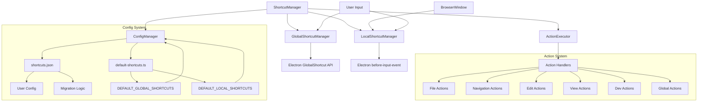
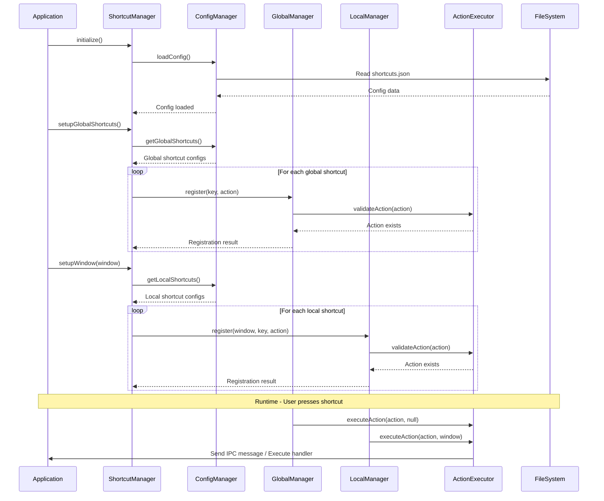

# Shortcut Management System

이 모듈은 not.e 애플리케이션의 단축키 관리 시스템을 구현합니다. 전역 단축키와 로컬 단축키를 분리하여 관리하며, 설정 기반의 영구 저장과 타입 안전성을 보장합니다.

## 아키텍처 개요



## 디렉토리 구조

```
shortcuts/
├── README.md                    # 이 문서
├── index.ts                     # 공개 API 및 팩토리 함수
├── types/                       # 타입 정의
│   ├── index.ts
│   └── shortcut-types.ts
├── managers/                    # 단축키 관리자들
│   ├── index.ts
│   ├── shortcut-manager.ts
│   ├── global-shortcut-manager.ts
│   └── local-shortcut-manager.ts
├── actions/                     # 액션 실행 관련
│   ├── index.ts
│   └── action-executor.ts
└── config/                      # 설정 관리
    ├── index.ts
    ├── config-manager.ts
    └── default-shortcuts.ts
│   └── shortcut-types.ts        # ShortcutConfig, 인터페이스 등
├── config/                      # 설정 관리
│   ├── index.ts
│   ├── config-manager.ts        # JSON 설정 파일 관리
│   └── default-shortcuts.ts     # 기본 단축키 정의
├── managers/                    # 단축키 관리자들
│   ├── index.ts
│   ├── shortcut-manager.ts      # 메인 관리자
│   ├── global-shortcut-manager.ts
│   └── local-shortcut-manager.ts
└── actions/                     # 액션 실행 시스템
    ├── index.ts
    └── action-executor.ts       # 액션 실행기
```

## 핵심 컴포넌트

### 1. ShortcutManager (managers/shortcut-manager.ts)

메인 관리자 클래스로 모든 단축키 관련 작업을 조율합니다.

```typescript
import { getShortcutManager } from './shortcuts'

const shortcutManager = getShortcutManager()

// 초기화 (앱 시작 시 한 번)
await shortcutManager.initialize()

// 전역 단축키 설정
await shortcutManager.setupGlobalShortcuts()

// 윈도우별 로컬 단축키 설정
await shortcutManager.setupWindow(window)
```

### 2. GlobalShortcutManager (managers/global-shortcut-manager.ts)

Electron의 `globalShortcut` API를 래핑하여 전역 단축키를 관리합니다.

```typescript
// 전역 단축키 등록
const success = globalManager.register('CmdOrCtrl+Shift+N', 'quick-note')

// 등록된 전역 단축키 확인
const shortcuts = globalManager.getRegisteredShortcuts()

// 전역 단축키 해제
globalManager.unregister('CmdOrCtrl+Shift+N')
```

### 3. LocalShortcutManager (managers/local-shortcut-manager.ts)

윈도우별 로컬 단축키를 `before-input-event`를 통해 관리합니다.

```typescript
// 윈도우별 로컬 단축키 등록
const success = localManager.register(window, 'CmdOrCtrl+S', 'save-note')

// 윈도우의 등록된 단축키 확인
const shortcuts = localManager.getRegisteredShortcuts(window)

// 특정 단축키 해제
localManager.unregister(window, 'CmdOrCtrl+S')
```

### 4. ActionExecutor (actions/action-executor.ts)

등록된 액션들을 실행하는 역할을 담당합니다.

```typescript
// 액션 등록
actionExecutor.registerAction({
  name: 'save-note',
  handler: (window) => window?.webContents.send('shortcut:save-note'),
  description: 'Save current note',
  category: 'file'
})

// 액션 실행
await actionExecutor.executeAction('save-note', window)
```

### 5. ConfigManager (config/config-manager.ts)

단축키 설정을 JSON 파일로 영구 저장하고 관리합니다.

```typescript
// 설정 로드
const config = await configManager.loadConfig()

// 새 단축키 추가
configManager.addLocalShortcut({
  key: 'CmdOrCtrl+K',
  action: 'custom-action',
  description: 'Custom action',
  category: 'custom'
})

// 설정 저장
await configManager.saveConfig()
```

### 6. Default Shortcuts Configuration (config/default-shortcuts.ts)

기본 단축키 설정들을 중앙화하여 관리합니다. 이 파일에서 모든 기본 단축키 정의를 담당합니다.

```typescript
import {
  DEFAULT_GLOBAL_SHORTCUTS,
  CROSS_DESKTOP_GLOBAL_SHORTCUTS,
  DEFAULT_LOCAL_SHORTCUTS
} from './config/default-shortcuts'

// 기본 전역 단축키들 (표준 모드)
console.log(DEFAULT_GLOBAL_SHORTCUTS)
// [
//   { key: 'CmdOrCtrl+Shift+N', action: 'quick-note', ... },
//   { key: 'CmdOrCtrl+Shift+T', action: 'toggle-window', ... }
// ]

// 크로스 데스크탑 전역 단축키들 (크로스 데스크탑 모드)
console.log(CROSS_DESKTOP_GLOBAL_SHORTCUTS)
// [
//   { key: 'CmdOrCtrl+Shift+N', action: 'quick-note', ... },
//   { key: 'CmdOrCtrl+Shift+T', action: 'toggle-window-cross-desktop', ... }
// ]

// 기본 로컬 단축키들 (카테고리별로 구성)
console.log(DEFAULT_LOCAL_SHORTCUTS)
// 파일, 네비게이션, 편집, 뷰, 개발자 도구 카테고리별 단축키들
```

### 윈도우 토글 모드 설정

두 가지 다른 윈도우 토글 동작을 제공합니다:

| 모드                     | 액션                          | 동작                                                      | 사용 시나리오               |
| ------------------------ | ----------------------------- | --------------------------------------------------------- | --------------------------- |
| **표준 모드**            | `toggle-window`               | 기본 윈도우 표시/숨김                                     | 일반적인 사용               |
| **크로스 데스크탑 모드** | `toggle-window-cross-desktop` | 현재 데스크탑에서 표시/숨김 + 커서 위치 디스플레이에 표시 | Raycast 스타일 동작 선호 시 |

```typescript
// 사용자 설정에 따른 단축키 선택
const appConfig = await appConfigRepository.load()
const shortcuts = appConfig.enableCrossDesktopToggle
  ? CROSS_DESKTOP_GLOBAL_SHORTCUTS
  : DEFAULT_GLOBAL_SHORTCUTS
```

## 데이터 흐름



## 사용 방법

### 기본 설정 및 초기화

```typescript
import { getShortcutManager } from './shortcuts'
import { getAllDefaultActions } from './actions'

// 1. 단축키 매니저 인스턴스 가져오기
const shortcutManager = getShortcutManager()

// 2. 초기화
await shortcutManager.initialize()

// 3. 기본 액션들 등록
const actions = getAllDefaultActions()
actions.forEach(action => {
  shortcutManager.registerAction(
    action.name,
    action.handler,
    action.description,
    action.category
  )
})

// 4. 전역 단축키 설정
await shortcutManager.setupGlobalShortcuts()

// 5. 윈도우 생성 시 로컬 단축키 설정
const window = new BrowserWindow({...})
await shortcutManager.setupWindow(window)
```

### 커스텀 단축키 추가

```typescript
// 새로운 액션 등록
shortcutManager.registerAction(
  'custom-action',
  (window) => {
    window?.webContents.send('custom:action')
  },
  'My custom action',
  'custom'
)

// 전역 단축키로 등록
await shortcutManager.registerGlobalShortcut(
  'CmdOrCtrl+Alt+C',
  'custom-action',
  'Custom global shortcut',
  'custom'
)

// 로컬 단축키로 등록
await shortcutManager.registerLocalShortcut(
  window,
  'CmdOrCtrl+Shift+C',
  'custom-action',
  'Custom local shortcut',
  'custom'
)
```

### 단축키 관리

```typescript
// 충돌 검사
const hasConflict = await shortcutManager.hasGlobalShortcutConflict('CmdOrCtrl+N')

// 등록된 단축키 조회
const globalShortcuts = await shortcutManager.getGlobalShortcutConfigs()
const localShortcuts = await shortcutManager.getLocalShortcutConfigs()

// 카테고리별 조회
const fileShortcuts = await shortcutManager.getShortcutsByCategory('file')

// 단축키 제거
await shortcutManager.unregisterGlobalShortcut('CmdOrCtrl+Shift+N')
await shortcutManager.unregisterLocalShortcut(window, 'CmdOrCtrl+S')

// 설정 초기화
await shortcutManager.resetToDefault()
```

## 설정 파일 구조

설정은 `~/.config/not.e/shortcuts.json`에 저장됩니다:

```json
{
  "version": "1.0.0",
  "lastModified": "2024-01-15T10:00:00.000Z",
  "shortcuts": {
    "global": [
      {
        "key": "CmdOrCtrl+Shift+N",
        "action": "quick-note",
        "description": "Quick note (global)",
        "category": "global"
      }
    ],
    "local": [
      {
        "key": "CmdOrCtrl+N",
        "action": "new-note",
        "description": "Create new note",
        "category": "file"
      },
      {
        "key": "CmdOrCtrl+S",
        "action": "save-note",
        "description": "Save current note",
        "category": "file"
      }
    ]
  }
}
```

## 확장 가능성

### 새로운 단축키 카테고리 추가

```typescript
// 1. types.ts에 새 카테고리 추가
export type ShortcutCategory = 'global' | 'file' | 'navigation' | 'edit' | 'view' | 'dev' | 'plugin'

// 2. default-shortcuts.ts에 새 단축키 추가
export const DEFAULT_LOCAL_SHORTCUTS: ShortcutConfig[] = [
  // ... 기존 단축키들

  // 플러그인 관련
  {
    key: 'CmdOrCtrl+Shift+P',
    action: 'plugin-manager',
    description: 'Open plugin manager',
    category: 'plugin'
  },
  {
    key: 'CmdOrCtrl+Alt+P',
    action: 'plugin-execute',
    description: 'Execute plugin',
    category: 'plugin'
  }
]

// 3. 새 카테고리의 액션들 정의
export function createPluginActions(): ShortcutAction[] {
  return [
    {
      name: 'plugin-manager',
      description: 'Open plugin manager',
      category: 'plugin',
      handler: (window: BrowserWindow | null): void => {
        window?.webContents.send('plugin:open-manager')
      }
    }
  ]
}
```

### 플랫폼별 단축키 지원

```typescript
// 플랫폼별 단축키 매핑
const platformShortcuts = {
  darwin: 'Cmd+N',
  win32: 'Ctrl+N',
  linux: 'Ctrl+N'
}

const key = platformShortcuts[process.platform] || 'Ctrl+N'
```

### 동적 단축키 변경

```typescript
// 런타임에 단축키 변경
await shortcutManager.unregisterLocalShortcut(window, 'CmdOrCtrl+S')
await shortcutManager.registerLocalShortcut(
  window,
  'CmdOrCtrl+Shift+S',
  'save-note',
  'Save note (new shortcut)',
  'file'
)
```

## 주의사항

1. **메모리 누수 방지**: `LocalShortcutManager`는 `WeakMap`을 사용하여 윈도우가 닫힐 때 자동으로 정리됩니다.

2. **전역 단축키 정리**: 앱 종료 시 모든 전역 단축키가 자동으로 해제됩니다.

3. **설정 마이그레이션**: 버전 업그레이드 시 기존 사용자 설정을 유지하면서 새로운 기본값을 추가합니다.

4. **타입 안전성**: 모든 핸들러는 `ShortcutActionHandler` 타입을 따라야 합니다.

5. **에러 처리**: 모든 단축키 등록/해제 작업은 try-catch로 감싸여 있어 실패 시에도 앱이 중단되지 않습니다.
