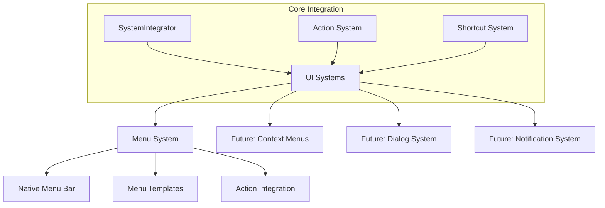

# User Interface Systems

이 디렉터리는 not.e 애플리케이션의 사용자 인터페이스 관련 시스템들을 포함합니다. 네이티브 데스크탑 애플리케이션의 UI 인프라를 담당합니다.

## 아키텍처 개요



## 현재 구현된 시스템

### 1. Menu System (`menu/`)

네이티브 데스크탑 애플리케이션의 메뉴 바 시스템을 제공합니다.

**주요 특징:**
- 네이티브 Electron 메뉴 API 활용
- 액션 시스템과 완전 통합
- macOS 표준 메뉴 구조 지원
- 단축키 자동 동기화
- TDD 방식으로 구현된 안정성

**구성 요소:**
- `MenuManager`: 메뉴 생성, 설정, 업데이트 관리
- `MenuTemplate`: 액션을 Electron 메뉴 템플릿으로 변환
- `MenuConfiguration`: 메뉴 라벨, 단축키, 구성 관리

**사용 예시:**
```typescript
import { getMenuManager } from './ui/menu'

const menuManager = getMenuManager()
await menuManager.initializeWithDefaultMenu()
```

## 향후 확장 계획

### Phase 3: Context Menu System
- 우클릭 컨텍스트 메뉴
- 상황별 메뉴 항목
- 에디터 영역별 특화 메뉴

### Phase 4: Dialog System
- 네이티브 대화상자 관리
- 파일 선택기 통합
- 확인/취소 대화상자

### Phase 5: Notification System
- 시스템 알림 통합
- 토스트 메시지
- 상태 표시

## 설계 원칙

1. **네이티브 우선**: 플랫폼 네이티브 UI 요소 활용
2. **시스템 통합**: 기존 액션/단축키 시스템과 완전 통합
3. **확장성**: 향후 UI 요소 추가를 고려한 구조
4. **일관성**: 플랫폼별 UI 가이드라인 준수

## 디렉터리 구조

```
ui/
├── README.md           # 이 문서
├── menu/              # 네이티브 메뉴 시스템
│   ├── README.md      # 메뉴 시스템 상세 문서
│   ├── index.ts       # 공개 API
│   ├── menu-manager.ts   # 메뉴 관리자
│   ├── menu-template.ts  # 메뉴 템플릿 생성
│   ├── menu-config.ts    # 메뉴 설정
│   └── menu-types.ts     # 타입 정의
└── [future modules]   # 향후 추가될 UI 모듈들
```

## 테스트

UI 시스템들은 포괄적인 단위 테스트로 검증됩니다:

```bash
# 전체 UI 시스템 테스트
bun x jest electron/__tests__/unit/ui/

# 메뉴 시스템 테스트
bun x jest electron/__tests__/unit/ui/menu/
```

## 개발 가이드

### 새로운 UI 시스템 추가

1. **디렉터리 생성**: `ui/[system-name]/`
2. **README 작성**: 시스템 문서화
3. **타입 정의**: TypeScript 인터페이스
4. **구현**: TDD 방식으로 개발
5. **테스트**: 포괄적인 단위 테스트
6. **통합**: SystemIntegrator에 연결

### 코딩 표준

- **네이밍**: UI 관련 클래스는 `UI` 접미사 사용 (예: `DialogUI`, `NotificationUI`)
- **의존성**: 항상 추상화된 인터페이스 사용
- **에러 처리**: UI 실패 시 앱 종료하지 않음
- **테스트**: 모든 public 메서드에 대한 테스트 필수

---

이 UI 시스템은 not.e의 네이티브 데스크탑 경험을 제공하는 핵심 인프라입니다.