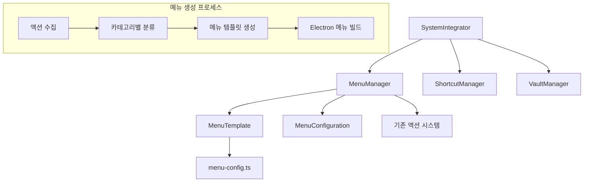

# Native Menu System

이 디렉토리는 not.e 애플리케이션의 네이티브 메뉴 시스템을 포함합니다. TDD(Test-Driven Development) 방식으로 구현되었으며, 기존 액션 시스템과 완전히 통합되어 있습니다.

## 아키텍처 개요



## 핵심 컴포넌트

### MenuManager (`menu-manager.ts`)
- **역할**: 메뉴 생성, 설정, 업데이트를 담당하는 메인 관리자
- **주요 기능**:
  - `createMenu()`: 액션 배열과 설정으로 메뉴 생성
  - `setApplicationMenu()`: 애플리케이션 메뉴 설정
  - `updateMenu()`: 메뉴 동적 업데이트
  - `cleanup()`: 메뉴 정리

```typescript
const menuManager = getMenuManager()
const menu = menuManager.createMenu(actions, config)
menuManager.setApplicationMenu(menu)
```

### MenuTemplate (`menu-template.ts`)
- **역할**: 액션들을 Electron 메뉴 템플릿으로 변환
- **주요 기능**:
  - 카테고리별 액션 분류 (File, Edit, View, Navigation)
  - macOS 표준 메뉴 구조 생성
  - 단축키 자동 바인딩

```typescript
const template = new MenuTemplate()
const menuTemplate = template.buildTemplate(actions, config)
```

### 메뉴 구성 시스템 (`menu-config.ts`, `menu-types.ts`)
- **역할**: 메뉴 라벨, 단축키, 구성 옵션 관리
- **주요 기능**:
  - 액션 이름 → 메뉴 라벨 변환
  - 액션 이름 → 단축키 매핑
  - 플랫폼별 메뉴 구성

## 사용 방법

### 1. 기본 사용법

```typescript
import { getMenuManager } from './menu'

const menuManager = getMenuManager()

// 기본 메뉴 초기화
menuManager.initializeWithDefaultMenu()

// 액션과 함께 메뉴 초기화
const actions = getAllDefaultActions()
menuManager.initializeWithActions(actions)
```

### 2. 메뉴 구성 커스터마이징

```typescript
import { DEFAULT_MENU_CONFIGURATION } from './menu-types'

const customConfig = {
  ...DEFAULT_MENU_CONFIGURATION,
  includeAppMenu: false,
  includeWindowMenu: false
}

menuManager.updateMenu(actions, customConfig)
```

### 3. 동적 메뉴 업데이트

```typescript
// 새로운 액션 추가
const newAction = {
  name: 'export-pdf',
  description: 'Export as PDF',
  category: ShortcutCategory.FILE,
  handler: (window) => { /* PDF 내보내기 로직 */ }
}

// 시스템 통합을 통한 추가
const systemIntegrator = getSystemIntegrator()
await systemIntegrator.addActionToMenu(newAction)
```

## 메뉴 구조

### macOS 표준 메뉴 구조

```
not.e
├── About not.e
├── Services
├── Hide not.e (⌘H)
├── Hide Others (⌘⇧H)
├── Show All
└── Quit not.e (⌘Q)

File
├── New Note (⌘N)
├── Open Vault (⌘O)
├── Save Note (⌘S)
└── Save All Notes (⌘⇧S)

Edit
├── Undo (⌘Z)
├── Redo (⇧⌘Z)
├── Cut (⌘X)
├── Copy (⌘C)
├── Paste (⌘V)
├── Select All (⌘A)
├── ──────────────
├── Find in Note (⌘F)
└── Find in Vault (⌘⇧F)

View
├── Toggle Sidebar (⌘B)
├── Toggle Preview (⌘\)
├── Zoom In (⌘+)
├── Zoom Out (⌘-)
└── Reset Zoom (⌘0)

Navigation
├── Quick Open (⌘P)
└── Command Palette (⌘⇧P)

Window
├── Minimize (⌘M)
├── Zoom
└── Bring All to Front
```

## 시스템 통합

### SystemIntegrator와의 통합

메뉴 시스템은 `SystemIntegrator`를 통해 다른 시스템들과 완전히 통합됩니다:

```typescript
// 시스템 초기화 시
await systemIntegrator.initializeMenuSystem()

// 윈도우 설정 시 자동 메뉴 초기화
await systemIntegrator.setupWindowIntegration(window)

// 액션 변경 시 메뉴 자동 업데이트
await systemIntegrator.updateMenuWithActions(newActions)
```

### 단축키 시스템과의 동기화

- 메뉴 항목의 가속기는 단축키 설정과 자동으로 동기화됩니다
- `menu-config.ts`의 `ACCELERATOR_MAP`에서 중앙 관리됩니다
- 단축키 변경 시 메뉴도 함께 업데이트됩니다

## 확장 가능성

### 1. 새로운 메뉴 카테고리 추가

```typescript
// 1. ShortcutCategory에 새 카테고리 추가
export enum ShortcutCategory {
  // 기존 카테고리들...
  EXPORT = 'export'
}

// 2. MenuTemplate에 새 메뉴 생성 메서드 추가
private createExportMenu(exportActions: ShortcutAction[]): MenuItemConstructorOptions {
  // 구현...
}

// 3. buildTemplate에 새 메뉴 추가
if (categorizedActions.export.length > 0) {
  template.push(this.createExportMenu(categorizedActions.export))
}
```

### 2. 컨텍스트 메뉴 시스템

향후 컨텍스트 메뉴 시스템 확장을 위한 기반이 마련되어 있습니다:

```typescript
// context-menu.ts (미래 구현)
export class ContextMenuManager {
  showContextMenu(position: { x: number, y: number }, items: MenuItemConstructorOptions[]) {
    // 컨텍스트 메뉴 표시 로직
  }
}
```

## 테스트

### 단위 테스트 실행

```bash
# 메뉴 관리자 테스트
bun x jest electron/__tests__/unit/core/menu/menu-manager.test.ts

# 메뉴 템플릿 테스트  
bun x jest electron/__tests__/unit/core/menu/menu-template.test.ts

# 시스템 통합 테스트
bun x jest electron/__tests__/unit/core/integration/system-integrator.test.ts
```

### 테스트 커버리지

- **MenuManager**: 11개 테스트 (초기화, 생성, 설정, 업데이트, 정리)
- **MenuTemplate**: 포괄적인 메뉴 생성 및 구성 테스트
- **SystemIntegrator**: 메뉴 시스템 통합 테스트

## 성능 고려사항

### 1. 메뉴 캐싱
- 동일한 액션 세트에 대해 메뉴 템플릿을 캐싱하여 성능 향상
- 설정 변경 시에만 메뉴 재생성

### 2. 지연 초기화
- 메뉴는 첫 번째 윈도우가 생성될 때까지 지연 초기화
- `isMenuSet()` 메서드로 초기화 상태 확인

### 3. 에러 처리
- 메뉴 생성 실패 시 앱 종료하지 않음
- 기본 메뉴로 폴백 메커니즘 제공

## 보안 고려사항

### 1. 액션 검증
- 메뉴에 등록되는 모든 액션은 기존 액션 시스템을 통해 검증
- 동적으로 추가되는 액션도 동일한 검증 과정 거침

### 2. 권한 관리
- 메뉴 항목 클릭은 IPC 권한 시스템과 연동
- 민감한 작업은 추가 권한 확인 단계 거침

## 향후 개발 계획

### Phase 3: 컨텍스트 메뉴 (추후 구현)
- 우클릭 컨텍스트 메뉴 시스템
- 상황별 메뉴 항목 표시
- 에디터 영역별 특화 메뉴

### Phase 5: 동적 메뉴 업데이트 (부분 구현됨)
- 플러그인 시스템과 연동된 메뉴 동적 추가/제거
- 사용자 설정 기반 메뉴 커스터마이징
- 메뉴 항목 순서 변경 및 그룹핑

## 문제 해결

### 1. 메뉴가 표시되지 않는 경우
```typescript
// 메뉴 상태 확인
const menuManager = getMenuManager()
if (!menuManager.isMenuSet()) {
  menuManager.initializeWithDefaultMenu()
}
```

### 2. 단축키가 작동하지 않는 경우
- `menu-config.ts`의 `ACCELERATOR_MAP` 확인
- 단축키 시스템과의 충돌 여부 확인
- macOS vs 다른 플랫폼의 단축키 차이 확인

### 3. 새로운 액션이 메뉴에 반영되지 않는 경우
```typescript
// 시스템 통합을 통한 액션 추가
await systemIntegrator.addActionToMenu(newAction)

// 또는 직접 메뉴 업데이트
const actions = [...existingActions, newAction]
menuManager.updateMenu(actions)
```

## 라이선스 및 의존성

이 메뉴 시스템은 not.e 프로젝트의 일부로서 상업적 사용이 가능하도록 설계되었습니다. 모든 의존성은 상업적 라이선스와 호환됩니다:

- **Electron**: MIT License
- **TypeScript**: Apache License 2.0
- **Jest**: MIT License

---

이 문서는 TDD로 구현된 네이티브 메뉴 시스템의 완전한 가이드입니다. 추가 질문이나 기능 요청은 프로젝트 이슈 트래커를 통해 문의해 주세요.