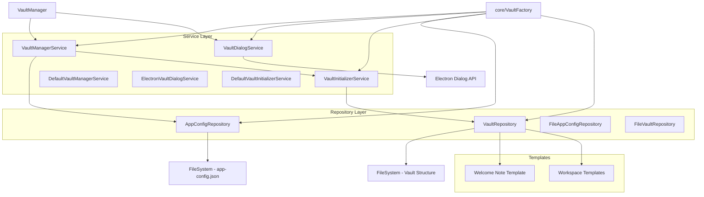
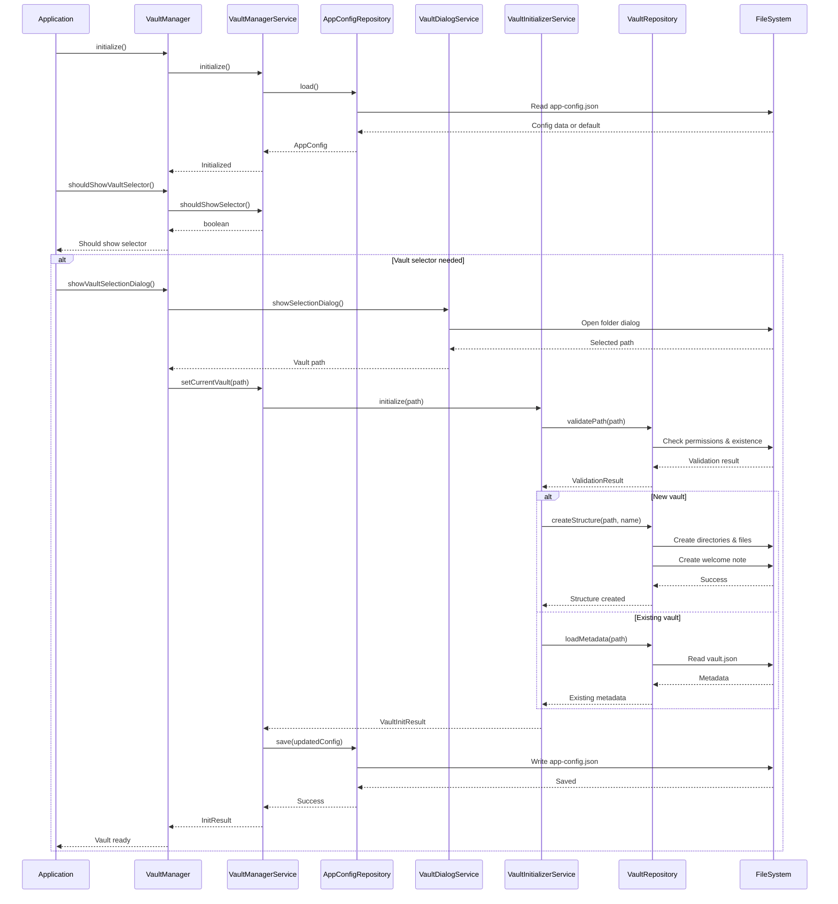
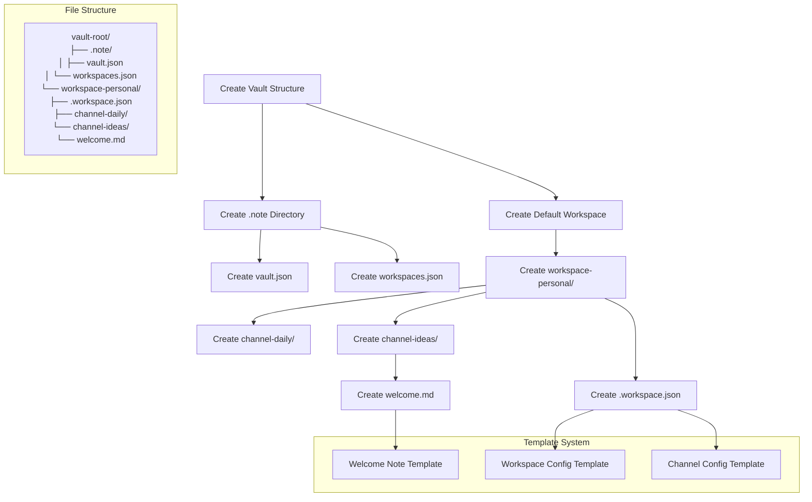

# Vault Management System

이 모듈은 not.e 애플리케이션의 Vault(노트 저장소) 관리 시스템을 구현합니다. Repository 패턴, Service 패턴, Factory 패턴을 활용하여 모듈화되고 유지보수가 쉬운 구조로 설계되었습니다.

## 아키텍처 개요



## 핵심 컴포넌트

### 1. Repository Layer (데이터 접근층)

#### FileAppConfigRepository

앱 설정 데이터의 영구 저장을 담당합니다.

```typescript
import { FileAppConfigRepository } from './repositories/app-config-repository'

const configRepo = new FileAppConfigRepository()

// 설정 로드
const config = await configRepo.load()

// 설정 저장
await configRepo.save({
  currentVault: '/path/to/vault',
  recentVaults: [...],
  showVaultSelector: false
})
```

**저장 위치**: `~/.config/not.e/app-config.json`

#### FileVaultRepository

Vault 파일 시스템 관리를 담당합니다.

```typescript
import { FileVaultRepository } from './repositories/vault-repository'

const vaultRepo = new FileVaultRepository()

// Vault 경로 유효성 검사
const validation = await vaultRepo.validatePath('/path/to/vault')

// 새 Vault 구조 생성
await vaultRepo.createStructure('/path/to/vault', 'My Vault')

// Vault 메타데이터 관리
const metadata = await vaultRepo.loadMetadata('/path/to/vault')
```

### 2. Service Layer (비즈니스 로직층)

#### VaultDialogService

사용자 인터페이스 다이얼로그를 처리합니다.

```typescript
import { ElectronVaultDialogService } from './services/vault-dialog-service'

const dialogService = new ElectronVaultDialogService()

// Vault 선택 다이얼로그
const selectedPath = await dialogService.showSelectionDialog(window)

// 새 Vault 생성 다이얼로그
const result = await dialogService.showCreateDialog(window)
```

#### VaultInitializerService

Vault 초기화 로직을 담당합니다.

```typescript
import { DefaultVaultInitializerService } from './services/vault-initializer-service'

const initService = new DefaultVaultInitializerService(vaultRepository)

// Vault 초기화
const result = await initService.initialize('/path/to/vault', 'Vault Name')

// 유효성 검사
const validation = await initService.validate('/path/to/vault')
```

#### VaultManagerService

Vault 관리의 핵심 비즈니스 로직을 담당합니다.

```typescript
import { DefaultVaultManagerService } from './services/vault-manager-service'

const managerService = new DefaultVaultManagerService(configRepo, initService)

// 서비스 초기화
await managerService.initialize()

// 현재 Vault 관리
const currentVault = await managerService.getCurrentVault()
await managerService.setCurrentVault('/new/path')

// 최근 Vault 관리
const recentVaults = await managerService.getRecentVaults()
await managerService.removeFromRecent('/old/path')
```

### 3. Factory Pattern

#### VaultFactory

의존성 주입과 객체 생성을 관리합니다.

```typescript
import { VaultFactory } from './vault-factory'

// 싱글톤 인스턴스 생성
const vaultManager = VaultFactory.createVaultManager()
const dialogService = VaultFactory.createDialogService()

// 테스트를 위한 리셋
VaultFactory.reset()
```

### 4. 메인 VaultManager

모든 기능을 통합하는 퍼사드 클래스입니다.

```typescript
import { getVaultManager } from './vault'

const vaultManager = getVaultManager()

// 초기화
await vaultManager.initialize()

// Vault 선택
const result = await vaultManager.showVaultSelectionDialog()

// 현재 Vault 관리
const current = await vaultManager.getCurrentVault()
```

## 데이터 흐름

### Vault 초기화 플로우



### Vault 구조 생성 플로우



## 사용 방법

### 기본 설정 및 초기화

```typescript
import { getVaultManager } from './vault'

// 1. Vault 매니저 인스턴스 가져오기
const vaultManager = getVaultManager()

// 2. 초기화
await vaultManager.initialize()

// 3. Vault 선택 여부 확인
if (vaultManager.shouldShowVaultSelector()) {
  const result = await vaultManager.showVaultSelectionDialog()

  if (result.success) {
    console.log(`Vault initialized: ${result.vault?.name}`)
    console.log(`Path: ${result.vault?.path}`)
    console.log(`Is new vault: ${result.isNewVault}`)
  } else {
    console.error(`Vault selection failed: ${result.error}`)
  }
}
```

### Vault 관리

```typescript
// 현재 Vault 조회
const currentVault = await vaultManager.getCurrentVault()
if (currentVault) {
  console.log(`Current vault: ${currentVault.name} at ${currentVault.path}`)
}

// 최근 Vault 목록 조회
const recentVaults = await vaultManager.getRecentVaults()
recentVaults.forEach((vault) => {
  console.log(`${vault.name}: ${vault.path} (${vault.lastAccessed})`)
})

// 다른 Vault로 전환
const switchResult = await vaultManager.setCurrentVault('/path/to/other/vault')
if (switchResult.success) {
  console.log('Vault switched successfully')
}

// 최근 목록에서 제거
await vaultManager.removeVaultFromRecent('/path/to/old/vault')
```

### 프로그래밍 방식으로 Vault 생성

```typescript
import { VaultFactory } from './vault-factory'

// 직접적인 서비스 사용
const initializerService = new DefaultVaultInitializerService(new FileVaultRepository())

// 새 Vault 생성
const result = await initializerService.initialize('/path/to/new/vault', 'My New Vault')

if (result.success && result.isNewVault) {
  console.log('New vault created with default structure')
}
```

## 설정 파일 구조

### App Config (`~/.config/not.e/app-config.json`)

```json
{
  "currentVault": "/Users/username/Documents/MyNotes",
  "recentVaults": [
    {
      "path": "/Users/username/Documents/MyNotes",
      "name": "My Notes",
      "createdAt": "2024-01-15T10:00:00.000Z",
      "lastAccessed": "2024-01-16T09:30:00.000Z",
      "isDefault": true
    }
  ],
  "showVaultSelector": false,
  "lastUsedVault": "/Users/username/Documents/MyNotes"
}
```

### Vault Metadata (`vault-root/.note/vault.json`)

```json
{
  "version": "1.0.0",
  "name": "My Notes",
  "description": "Notes vault: My Notes",
  "createdAt": "2024-01-15T10:00:00.000Z",
  "lastModified": "2024-01-16T09:30:00.000Z"
}
```

### Workspace Configuration (`vault-root/.note/workspaces.json`)

```json
{
  "workspaces": [
    {
      "id": "default",
      "name": "Personal",
      "path": "workspace-personal",
      "createdAt": "2024-01-15T10:00:00.000Z",
      "isDefault": true
    }
  ],
  "activeWorkspace": "default"
}
```

### Individual Workspace (`workspace-personal/.workspace.json`)

```json
{
  "id": "default",
  "name": "Personal",
  "description": "Personal notes and ideas",
  "channels": [
    {
      "id": "daily",
      "name": "Daily Notes",
      "path": "channel-daily",
      "type": "daily"
    },
    {
      "id": "ideas",
      "name": "Ideas",
      "path": "channel-ideas",
      "type": "notes"
    }
  ],
  "createdAt": "2024-01-15T10:00:00.000Z"
}
```

## 확장 가능성

### 새로운 저장소 구현

```typescript
// 클라우드 기반 저장소 구현 예시
export class CloudVaultRepository implements VaultRepository {
  async validatePath(vaultPath: string): Promise<VaultValidationResult> {
    // 클라우드 저장소 유효성 검사 로직
  }

  async createStructure(vaultPath: string, vaultName: string): Promise<void> {
    // 클라우드에 Vault 구조 생성
  }

  async loadMetadata(vaultPath: string): Promise<VaultMetadata | null> {
    // 클라우드에서 메타데이터 로드
  }

  async saveMetadata(vaultPath: string, metadata: VaultMetadata): Promise<void> {
    // 클라우드에 메타데이터 저장
  }
}

// Factory에서 사용
export class VaultFactory {
  static createVaultRepository(type: 'file' | 'cloud'): VaultRepository {
    switch (type) {
      case 'file':
        return new FileVaultRepository()
      case 'cloud':
        return new CloudVaultRepository()
      default:
        throw new Error(`Unknown repository type: ${type}`)
    }
  }
}
```

### 커스텀 템플릿 시스템

```typescript
// 새로운 템플릿 추가
export function createProjectNoteTemplate(projectName: string): string {
  return `---
title: "${projectName} Project Notes"
type: project
created: ${new Date().toISOString()}
tags: [project, ${projectName.toLowerCase()}]
---

# ${projectName} Project

## Overview
<!-- Project description -->

## Goals
- [ ] Goal 1
- [ ] Goal 2

## Resources
- [Documentation](link)
- [Repository](link)

## Progress Log
<!-- Daily progress updates -->
`
}

// VaultRepository에서 사용
private async createProjectWorkspace(vaultPath: string, projectName: string): Promise<void> {
  const projectContent = createProjectNoteTemplate(projectName)
  const projectPath = join(vaultPath, `project-${projectName.toLowerCase()}`, 'overview.md')
  await fs.writeFile(projectPath, projectContent, 'utf-8')
}
```

### 플러그인 시스템 통합

```typescript
// 플러그인 인터페이스
interface VaultPlugin {
  name: string
  version: string
  onVaultCreated(vaultPath: string): Promise<void>
  onVaultLoaded(vaultPath: string): Promise<void>
}

// VaultInitializerService 확장
export class PluginAwareVaultInitializerService extends DefaultVaultInitializerService {
  private plugins: VaultPlugin[] = []

  registerPlugin(plugin: VaultPlugin): void {
    this.plugins.push(plugin)
  }

  async initialize(vaultPath: string, vaultName?: string): Promise<VaultInitResult> {
    const result = await super.initialize(vaultPath, vaultName)

    if (result.success && result.vault) {
      // 플러그인 알림
      for (const plugin of this.plugins) {
        if (result.isNewVault) {
          await plugin.onVaultCreated(result.vault.path)
        } else {
          await plugin.onVaultLoaded(result.vault.path)
        }
      }
    }

    return result
  }
}
```

## 에러 처리

### 일반적인 에러 시나리오

```typescript
// 1. 권한 오류 처리
try {
  const result = await vaultManager.setCurrentVault('/restricted/path')
  if (!result.success) {
    switch (result.error) {
      case 'No write permission for this directory':
        // 사용자에게 권한 문제 알림
        break
      case 'Path does not exist or is not accessible':
        // 경로 문제 알림
        break
      default:
      // 일반적인 오류 처리
    }
  }
} catch (error) {
  console.error('Unexpected error:', error)
}

// 2. 네트워크 저장소 오류 처리
const validation = await vaultRepository.validatePath(networkPath)
if (!validation.isValid) {
  if (validation.error?.includes('network')) {
    // 네트워크 연결 확인 요청
  } else if (validation.error?.includes('permission')) {
    // 인증 정보 확인 요청
  }
}
```

## 테스팅

### 단위 테스트 예시

```typescript
// VaultRepository 테스트
describe('FileVaultRepository', () => {
  let repository: FileVaultRepository
  let tempDir: string

  beforeEach(async () => {
    repository = new FileVaultRepository()
    tempDir = await fs.mkdtemp(join(os.tmpdir(), 'vault-test-'))
  })

  afterEach(async () => {
    await fs.rm(tempDir, { recursive: true })
  })

  test('should validate existing directory', async () => {
    const result = await repository.validatePath(tempDir)
    expect(result.isValid).toBe(true)
    expect(result.canWrite).toBe(true)
  })

  test('should create vault structure', async () => {
    await repository.createStructure(tempDir, 'Test Vault')

    const metadataPath = join(tempDir, '.note', 'vault.json')
    expect(await fs.access(metadataPath)).not.toThrow()

    const welcomePath = join(tempDir, 'workspace-personal', 'channel-ideas', 'welcome.md')
    expect(await fs.access(welcomePath)).not.toThrow()
  })
})
```

## 성능 고려사항

1. **지연 로딩**: Vault 메타데이터는 필요할 때만 로드
2. **캐싱**: 자주 접근하는 설정 데이터 메모리 캐시
3. **비동기 처리**: 모든 파일 I/O 작업은 비동기로 처리
4. **배치 작업**: 여러 파일 작업을 배치로 처리하여 성능 최적화

## 보안 고려사항

1. **경로 검증**: 모든 파일 경로에 대한 유효성 검사
2. **권한 확인**: 읽기/쓰기 권한 사전 확인
3. **입력 검증**: 사용자 입력 데이터 검증
4. **에러 정보**: 민감한 시스템 정보 노출 방지
