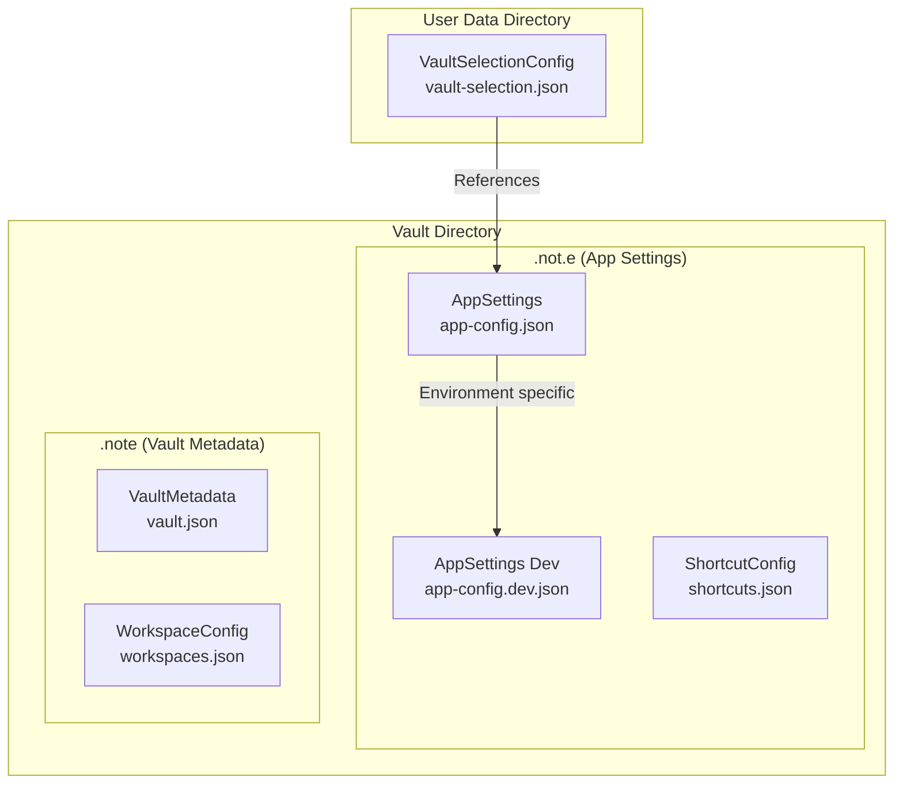

# Vault Repositories

This module contains the repository implementations for data persistence in the vault system. The repositories follow the Repository pattern to abstract data access and provide clean interfaces for different types of configuration and data storage.

## Architecture Overview

The repository layer is split into three main areas:

1. **Vault Selection Configuration** - Stored in userData directory
2. **App Settings** - Stored per-vault in `.not.e` directory
3. **Vault Metadata** - Stored in `.note` directory within each vault



## Repository Classes

### VaultSelectionConfigRepository

Manages vault selection and recent vault history in the global userData directory.

**Storage Location**: `{userData}/vault-selection.json`

**Responsibilities**:
- Current vault selection
- Recent vaults list (up to 10)
- Vault selector visibility preference
- Last used vault tracking

```typescript
interface VaultSelectionConfig {
  currentVault?: string
  recentVaults: VaultConfig[]
  showVaultSelector: boolean
  lastUsedVault?: string
}
```

### AppSettingsRepository

Manages vault-specific application settings within each vault's `.not.e` directory.

**Storage Location**: 
- Production: `{vaultPath}/.not.e/app-config.json`
- Development: `{vaultPath}/.not.e/app-config.dev.json`

**Responsibilities**:
- Window mode configuration
- Toggle settings (sidebar position, width, type)
- Legacy setting migration

```typescript
interface AppSettings {
  windowMode: 'normal' | 'toggle'
  toggleSettings?: ToggleSettings
  enableCrossDesktopToggle?: boolean // Legacy field
}
```

**Key Methods**:
- `ensureConfigDirectory(vaultPath)` - Creates `.not.e` directory if needed
- Environment-specific file selection based on `isDev` flag
- Automatic migration of legacy settings

### AppConfigRepository (Legacy Compatibility)

Provides backward compatibility by combining VaultSelectionConfig and AppSettings into a unified interface.

**Purpose**: Maintains compatibility with existing code while internally delegating to the new split repositories.

**Implementation**:
- Delegates vault selection operations to `VaultSelectionConfigRepository`
- Delegates app settings operations to `AppSettingsRepository`
- Provides migration from old userData-based configuration

### VaultRepository

Manages vault filesystem operations and metadata.

**Storage Location**: `{vaultPath}/.note/`

**Responsibilities**:
- Vault structure creation and validation
- Vault metadata management
- Path validation and accessibility checks

## Configuration Migration

### Legacy to New Structure Migration

The system automatically migrates from the old single-file configuration to the new split structure:

1. **Detection**: Checks for legacy files (`app-config.json`/`app-config.dev.json` in userData)
2. **Split**: Separates vault selection data from app settings
3. **Transfer**: Moves app settings to current vault's `.not.e` directory
4. **Backup**: Creates backup of legacy configuration
5. **Cleanup**: Removes legacy files after successful migration

```typescript
// Migration flow
const legacyConfig = await readLegacyConfig()
const { vaultSelection, appSettings } = splitConfig(legacyConfig)

await vaultSelectionRepo.save(vaultSelection)
await appSettingsRepo.save(currentVault, appSettings)
await backupAndRemoveLegacy()
```

## Environment-Specific Configuration

### Development vs Production

The system uses different configuration files for development and production:

- **Development**: Uses `app-config.dev.json` when `NODE_ENV === 'development'` or undefined
- **Production**: Uses `app-config.json` in production builds

This allows developers to maintain separate vault configurations and app settings during development without affecting production settings.

## Directory Structure Creation

### .not.e Directory Management

The AppSettingsRepository automatically creates the `.not.e` directory structure when saving settings:

```
vault-root/
├── .note/                    # Existing vault metadata
└── .not.e/                   # New app settings directory
    ├── app-config.json       # Production app settings
    ├── app-config.dev.json   # Development app settings
    └── shortcuts.json        # Keyboard shortcuts (future)
```

The directory is created with proper permissions and error handling to ensure reliable operation across different operating systems.

## Error Handling

All repositories implement comprehensive error handling:

- **File Not Found**: Creates default configuration
- **JSON Parse Errors**: Falls back to defaults with error logging
- **Permission Errors**: Throws descriptive errors for UI handling
- **Migration Errors**: Logs warnings but doesn't block startup

## Usage Examples

### Basic Configuration Operations

```typescript
// Load vault selection
const vaultSelectionRepo = new FileVaultSelectionConfigRepository()
const selection = await vaultSelectionRepo.load()

// Load vault-specific app settings
const appSettingsRepo = new FileAppSettingsRepository()
const settings = await appSettingsRepo.load('/path/to/vault')

// Use legacy interface for backward compatibility
const legacyRepo = new FileAppConfigRepository()
legacyRepo.setCurrentVaultPath('/path/to/vault')
const combinedConfig = await legacyRepo.load()
```

### Migration and Setup

```typescript
// Trigger migration from legacy configuration
await legacyRepo.migrateFromLegacyConfig()

// Ensure .not.e directory exists for a vault
await appSettingsRepo.ensureConfigDirectory('/path/to/vault')
```

This repository layer provides a clean separation of concerns while maintaining backward compatibility and supporting the transition from the old configuration system to the new vault-based approach.