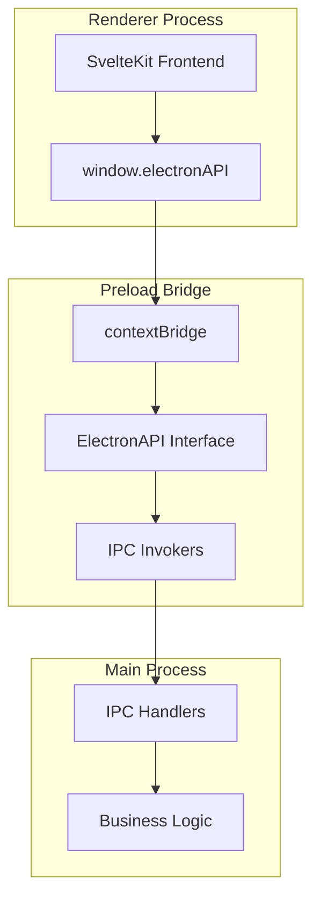

# Preload Bridge System

이 모듈은 not.e 애플리케이션의 보안 브릿지 시스템을 구현합니다. Electron의 contextBridge API를 사용하여 메인 프로세스와 렌더러 프로세스 간의 안전한 통신을 제공합니다.

## 아키텍처 개요



## 핵심 컴포넌트

### 1. ElectronAPI Interface

렌더러 프로세스에서 사용할 수 있는 모든 API의 타입 정의입니다.

```typescript
export interface ElectronAPI {
  // App Information APIs
  getAppVersion: () => Promise<string>
  getPlatform: () => Promise<NodeJS.Platform>

  // Toggle Mode Configuration APIs
  getCrossDesktopToggleEnabled: () => Promise<boolean>
  setCrossDesktopToggleEnabled: (enabled: boolean) => Promise<void>
}
```

### 2. Context Bridge Implementation

```typescript
import { contextBridge, ipcRenderer } from 'electron'

const electronAPI: ElectronAPI = {
  // App Information
  getAppVersion: () => ipcRenderer.invoke('get-app-version'),
  getPlatform: () => ipcRenderer.invoke('get-platform'),

  // Toggle Mode Configuration
  getCrossDesktopToggleEnabled: () => ipcRenderer.invoke('get-cross-desktop-toggle-enabled'),
  setCrossDesktopToggleEnabled: (enabled: boolean) =>
    ipcRenderer.invoke('set-cross-desktop-toggle-enabled', enabled)
}

contextBridge.exposeInMainWorld('electronAPI', electronAPI)
```

### 3. Global Type Declaration

```typescript
declare global {
  interface Window {
    electronAPI: ElectronAPI
  }
}
```

## 사용 가능한 APIs

### App Information APIs

#### `getAppVersion()`

- **설명**: 현재 애플리케이션 버전을 조회합니다
- **권한 레벨**: PUBLIC
- **반환값**: `Promise<string>`

```typescript
const version = await window.electronAPI.getAppVersion()
console.log(`App version: ${version}`)
```

#### `getPlatform()`

- **설명**: 현재 실행 중인 플랫폼 정보를 조회합니다
- **권한 레벨**: PUBLIC
- **반환값**: `Promise<NodeJS.Platform>`

```typescript
const platform = await window.electronAPI.getPlatform()
console.log(`Platform: ${platform}`)
```

### Toggle Mode Configuration APIs

#### `getCrossDesktopToggleEnabled()`

- **설명**: 크로스 데스크탑 토글 모드의 현재 활성화 상태를 확인합니다
- **권한 레벨**: ROOT (메인 윈도우에서만 접근 가능)
- **반환값**: `Promise<boolean>`

```typescript
const isEnabled = await window.electronAPI.getCrossDesktopToggleEnabled()
if (isEnabled) {
  console.log('Cross-desktop toggle mode is enabled')
} else {
  console.log('Standard toggle mode is active')
}
```

#### `setCrossDesktopToggleEnabled(enabled: boolean)`

- **설명**: 크로스 데스크탑 토글 모드를 활성화/비활성화합니다
- **권한 레벨**: ROOT (메인 윈도우에서만 접근 가능)
- **매개변수**:
  - `enabled: boolean` - 활성화 여부
- **반환값**: `Promise<void>`

```typescript
// 크로스 데스크탑 토글 모드 활성화
await window.electronAPI.setCrossDesktopToggleEnabled(true)

// 표준 토글 모드로 변경
await window.electronAPI.setCrossDesktopToggleEnabled(false)
```

## 사용 방법

### SvelteKit 컴포넌트에서 사용

```typescript
<!-- Settings.svelte -->
<script lang="ts">
  import { onMount } from 'svelte'

  let crossDesktopEnabled = false
  let appVersion = ''
  let platform = ''

  onMount(async () => {
    // 앱 정보 로드
    appVersion = await window.electronAPI.getAppVersion()
    platform = await window.electronAPI.getPlatform()

    // 토글 모드 상태 로드
    crossDesktopEnabled = await window.electronAPI.getCrossDesktopToggleEnabled()
  })

  async function toggleCrossDesktopMode() {
    await window.electronAPI.setCrossDesktopToggleEnabled(!crossDesktopEnabled)
    crossDesktopEnabled = !crossDesktopEnabled
  }
</script>

<div class="settings-panel">
  <h2>Application Settings</h2>

  <div class="info-section">
    <p>Version: {appVersion}</p>
    <p>Platform: {platform}</p>
  </div>

  <div class="toggle-section">
    <label>
      <input
        type="checkbox"
        bind:checked={crossDesktopEnabled}
        on:change={toggleCrossDesktopMode}
      />
      Enable Cross-Desktop Toggle Mode
    </label>
    <p class="help-text">
      {#if crossDesktopEnabled}
        Window will appear on all desktops and follow cursor position
      {:else}
        Window will toggle on current desktop only
      {/if}
    </p>
  </div>
</div>
```

### React/Vue에서 사용 (향후 지원)

```typescript
// React 예제
import { useEffect, useState } from 'react'

function SettingsPanel() {
  const [crossDesktopEnabled, setCrossDesktopEnabled] = useState(false)
  const [appInfo, setAppInfo] = useState({ version: '', platform: '' })

  useEffect(() => {
    const loadSettings = async () => {
      const [version, platform, toggleEnabled] = await Promise.all([
        window.electronAPI.getAppVersion(),
        window.electronAPI.getPlatform(),
        window.electronAPI.getCrossDesktopToggleEnabled()
      ])

      setAppInfo({ version, platform })
      setCrossDesktopEnabled(toggleEnabled)
    }

    loadSettings()
  }, [])

  const handleToggleChange = async (enabled: boolean) => {
    await window.electronAPI.setCrossDesktopToggleEnabled(enabled)
    setCrossDesktopEnabled(enabled)
  }

  return (
    <div className="settings-panel">
      <h2>Settings</h2>
      <p>Version: {appInfo.version}</p>
      <p>Platform: {appInfo.platform}</p>

      <label>
        <input
          type="checkbox"
          checked={crossDesktopEnabled}
          onChange={(e) => handleToggleChange(e.target.checked)}
        />
        Cross-Desktop Toggle Mode
      </label>
    </div>
  )
}
```

## 보안 고려사항

### Context Bridge 보안

1. **격리된 컨텍스트**: contextBridge는 메인 월드와 격리된 컨텍스트에서 실행됩니다
2. **명시적 노출**: 오직 명시적으로 정의된 API만 렌더러 프로세스에서 접근 가능합니다
3. **타입 안전성**: TypeScript 인터페이스를 통한 타입 안전성 보장

### 권한 관리

- **ROOT 레벨 API**: 메인 윈도우에서만 접근 가능한 민감한 설정 API들
- **PUBLIC 레벨 API**: 일반 정보 조회 API들로 모든 컨텍스트에서 접근 가능

## 새로운 API 추가 방법

### 1. ElectronAPI 인터페이스 확장

```typescript
export interface ElectronAPI {
  // 기존 APIs...

  // 새로운 API 추가
  newFeature: {
    getData: () => Promise<SomeData>
    setData: (data: SomeData) => Promise<void>
  }
}
```

### 2. 구현체 추가

```typescript
const electronAPI: ElectronAPI = {
  // 기존 구현...

  newFeature: {
    getData: () => ipcRenderer.invoke('new-feature:get-data'),
    setData: (data: SomeData) => ipcRenderer.invoke('new-feature:set-data', data)
  }
}
```

### 3. IPC 핸들러 구현

메인 프로세스에서 해당 IPC 핸들러를 구현해야 합니다.

```typescript
// handlers/new-feature-handlers.ts
export function createNewFeatureHandlers(): IPCHandler[] {
  return [
    {
      channel: 'new-feature:get-data',
      handler: async () => {
        return await getFeatureData()
      },
      permission: {
        level: IPCPermissionLevel.ROOT,
        description: 'Get feature data'
      }
    }
  ]
}
```

## 에러 처리

### API 호출 에러 처리

```typescript
try {
  const result = await window.electronAPI.getCrossDesktopToggleEnabled()
  console.log('Toggle mode enabled:', result)
} catch (error) {
  console.error('Failed to get toggle mode status:', error)
  // 사용자에게 에러 표시
}
```

### 권한 에러 처리

```typescript
try {
  await window.electronAPI.setCrossDesktopToggleEnabled(true)
} catch (error) {
  if (error.message.includes('Permission denied')) {
    console.error('Access denied: This operation requires ROOT permission')
    // 권한 부족 알림 표시
  } else {
    console.error('Unknown error:', error)
  }
}
```

## 개발 도구

### 타입 체크

```bash
# TypeScript 타입 체크
bun run typecheck
```

### 개발 모드에서 API 테스트

```typescript
// 개발자 콘솔에서 테스트
window.electronAPI.getAppVersion().then(console.log)
window.electronAPI.getCrossDesktopToggleEnabled().then(console.log)
```

## 모범 사례

1. **항상 타입 안전성 확보**: TypeScript 인터페이스를 통한 타입 정의
2. **에러 처리**: 모든 API 호출에 적절한 에러 처리 구현
3. **권한 인지**: API의 권한 레벨을 이해하고 적절히 사용
4. **비동기 처리**: 모든 API가 Promise를 반환하므로 async/await 사용
5. **문서화**: 새로운 API 추가 시 문서 업데이트
