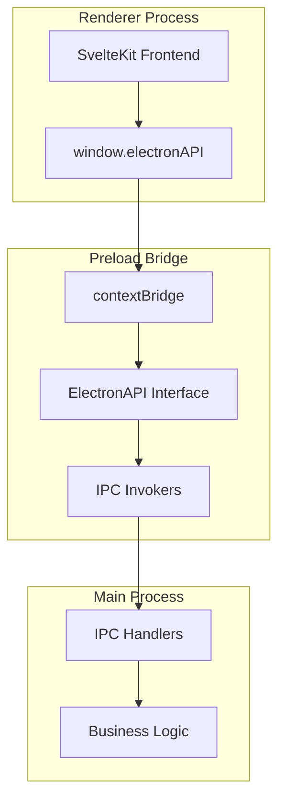

# Preload Bridge System

이 모듈은 not.e 애플리케이션의 보안 브릿지 시스템을 구현합니다. Electron의 contextBridge API를 사용하여 메인 프로세스와 렌더러 프로세스 간의 안전한 통신을 제공합니다.

## 아키텍처 개요



## 핵심 컴포넌트

### 1. ElectronAPI Interface

렌더러 프로세스에서 사용할 수 있는 모든 API의 타입 정의입니다.

```typescript
export interface ToggleSettings {
  toggleType: 'sidebar' | 'standard'
  sidebarPosition?: 'left' | 'right'
  sidebarWidth?: number
}

export interface AppConfig {
  currentVault?: string
  recentVaults: any[]
  showVaultSelector: boolean
  lastUsedVault?: string
  windowMode: 'normal' | 'toggle'
  toggleSettings?: ToggleSettings
  enableCrossDesktopToggle?: boolean
}

export interface ElectronAPI {
  // App Information APIs
  getAppVersion: () => Promise<string>
  getPlatform: () => Promise<NodeJS.Platform>
  
  // 새로운 윈도우 모드 API
  getWindowMode: () => Promise<'normal' | 'toggle'>
  setWindowMode: (mode: 'normal' | 'toggle') => Promise<void>
  getToggleSettings: () => Promise<ToggleSettings>
  setToggleSettings: (settings: ToggleSettings) => Promise<void>
  getAppConfig: () => Promise<AppConfig>
  
  // 레거시 API (하위 호환성)
  getCrossDesktopToggleEnabled: () => Promise<boolean>
  setCrossDesktopToggleEnabled: (enabled: boolean) => Promise<void>
}
```

### 2. Context Bridge Implementation

```typescript
import { contextBridge, ipcRenderer } from 'electron'

const electronAPI: ElectronAPI = {
  // App Information
  getAppVersion: () => ipcRenderer.invoke('get-app-version'),
  getPlatform: () => ipcRenderer.invoke('get-platform'),

  // Toggle Mode Configuration
  getCrossDesktopToggleEnabled: () => ipcRenderer.invoke('get-cross-desktop-toggle-enabled'),
  setCrossDesktopToggleEnabled: (enabled: boolean) =>
    ipcRenderer.invoke('set-cross-desktop-toggle-enabled', enabled)
}

contextBridge.exposeInMainWorld('electronAPI', electronAPI)
```

### 3. Global Type Declaration

```typescript
declare global {
  interface Window {
    electronAPI: ElectronAPI
  }
}
```

## 사용 가능한 APIs

### App Information APIs

#### `getAppVersion()`

- **설명**: 현재 애플리케이션 버전을 조회합니다
- **권한 레벨**: PUBLIC
- **반환값**: `Promise<string>`

```typescript
const version = await window.electronAPI.getAppVersion()
console.log(`App version: ${version}`)
```

#### `getPlatform()`

- **설명**: 현재 실행 중인 플랫폼 정보를 조회합니다
- **권한 레벨**: PUBLIC
- **반환값**: `Promise<NodeJS.Platform>`

```typescript
const platform = await window.electronAPI.getPlatform()
console.log(`Platform: ${platform}`)
```

### 새로운 윈도우 모드 Configuration APIs

#### `getWindowMode()`

- **설명**: 현재 윈도우 모드를 조회합니다
- **권한 레벨**: ROOT (메인 윈도우에서만 접근 가능)
- **반환값**: `Promise<'normal' | 'toggle'>`

```typescript
const mode = await window.electronAPI.getWindowMode()
console.log(`Current window mode: ${mode}`)
```

#### `setWindowMode(mode: 'normal' | 'toggle')`

- **설명**: 윈도우 모드를 설정합니다
- **권한 레벨**: ROOT (메인 윈도우에서만 접근 가능)
- **매개변수**:
  - `mode: 'normal' | 'toggle'` - 윈도우 모드
- **반환값**: `Promise<void>`

```typescript
// 토글 모드로 변경
await window.electronAPI.setWindowMode('toggle')

// 일반 모드로 변경
await window.electronAPI.setWindowMode('normal')
```

#### `getToggleSettings()`

- **설명**: 현재 토글 설정을 조회합니다
- **권한 레벨**: ROOT (메인 윈도우에서만 접근 가능)
- **반환값**: `Promise<ToggleSettings>`

```typescript
const settings = await window.electronAPI.getToggleSettings()
console.log(`Toggle type: ${settings.toggleType}`)
console.log(`Sidebar position: ${settings.sidebarPosition}`)
console.log(`Sidebar width: ${settings.sidebarWidth}px`)
```

#### `setToggleSettings(settings: ToggleSettings)`

- **설명**: 토글 설정을 변경합니다
- **권한 레벨**: ROOT (메인 윈도우에서만 접근 가능)
- **매개변수**:
  - `settings: ToggleSettings` - 토글 설정 객체
- **반환값**: `Promise<void>`

```typescript
// 사이드바 모드로 설정
await window.electronAPI.setToggleSettings({
  toggleType: 'sidebar',
  sidebarPosition: 'right',
  sidebarWidth: 350
})

// 표준 모드로 설정
await window.electronAPI.setToggleSettings({
  toggleType: 'standard'
})
```

#### `getAppConfig()`

- **설명**: 전체 앱 설정을 조회합니다
- **권한 레벨**: ROOT (메인 윈도우에서만 접근 가능)
- **반환값**: `Promise<AppConfig>`

```typescript
const config = await window.electronAPI.getAppConfig()
console.log('Complete app configuration:', config)
```

### 레거시 Toggle Mode APIs (하위 호환성)

#### `getCrossDesktopToggleEnabled()`

- **설명**: 크로스 데스크탑 토글 모드의 현재 활성화 상태를 확인합니다 (deprecated)
- **권한 레벨**: ROOT (메인 윈도우에서만 접근 가능)
- **반환값**: `Promise<boolean>`

```typescript
const isEnabled = await window.electronAPI.getCrossDesktopToggleEnabled()
if (isEnabled) {
  console.log('Toggle mode is enabled (legacy check)')
}
```

#### `setCrossDesktopToggleEnabled(enabled: boolean)`

- **설명**: 크로스 데스크탑 토글 모드를 활성화/비활성화합니다 (deprecated)
- **권한 레벨**: ROOT (메인 윈도우에서만 접근 가능)
- **매개변수**:
  - `enabled: boolean` - 활성화 여부
- **반환값**: `Promise<void>`

```typescript
// 레거시 API (새 API 사용 권장)
await window.electronAPI.setCrossDesktopToggleEnabled(true)
```

## 사용 방법

### SvelteKit 컴포넌트에서 사용

```typescript
<!-- WindowModeSettings.svelte -->
<script lang="ts">
  import { onMount } from 'svelte'
  import type { ToggleSettings } from '../types/electron'

  let appVersion = ''
  let platform = ''
  let windowMode: 'normal' | 'toggle' = 'normal'
  let toggleSettings: ToggleSettings = {
    toggleType: 'standard',
    sidebarPosition: 'right',
    sidebarWidth: 400
  }

  onMount(async () => {
    // 앱 정보 로드
    appVersion = await window.electronAPI.getAppVersion()
    platform = await window.electronAPI.getPlatform()

    // 윈도우 모드 및 설정 로드
    windowMode = await window.electronAPI.getWindowMode()
    if (windowMode === 'toggle') {
      toggleSettings = await window.electronAPI.getToggleSettings()
    }
  })

  async function updateWindowMode() {
    await window.electronAPI.setWindowMode(windowMode)
    if (windowMode === 'toggle') {
      await window.electronAPI.setToggleSettings(toggleSettings)
    }
  }

  async function updateToggleSettings() {
    if (windowMode === 'toggle') {
      await window.electronAPI.setToggleSettings(toggleSettings)
    }
  }
</script>

<div class="settings-panel">
  <h2>Window Mode Settings</h2>

  <div class="info-section">
    <p>Version: {appVersion}</p>
    <p>Platform: {platform}</p>
  </div>

  <div class="window-mode-section">
    <h3>Window Mode</h3>
    <label>
      <input
        type="radio"
        bind:group={windowMode}
        value="normal"
        on:change={updateWindowMode}
      />
      Normal Mode (no toggle)
    </label>
    <label>
      <input
        type="radio"
        bind:group={windowMode}
        value="toggle"
        on:change={updateWindowMode}
      />
      Toggle Mode
    </label>
  </div>

  {#if windowMode === 'toggle'}
    <div class="toggle-settings-section">
      <h3>Toggle Settings</h3>
      
      <div class="toggle-type">
        <label>
          <input
            type="radio"
            bind:group={toggleSettings.toggleType}
            value="standard"
            on:change={updateToggleSettings}
          />
          Standard (center screen)
        </label>
        <label>
          <input
            type="radio"
            bind:group={toggleSettings.toggleType}
            value="sidebar"
            on:change={updateToggleSettings}
          />
          Sidebar (fixed width)
        </label>
      </div>

      {#if toggleSettings.toggleType === 'sidebar'}
        <div class="sidebar-settings">
          <label>
            Position:
            <select
              bind:value={toggleSettings.sidebarPosition}
              on:change={updateToggleSettings}
            >
              <option value="left">Left</option>
              <option value="right">Right</option>
            </select>
          </label>
          
          <label>
            Width: {toggleSettings.sidebarWidth}px
            <input
              type="range"
              min="200"
              max="800"
              bind:value={toggleSettings.sidebarWidth}
              on:input={updateToggleSettings}
            />
          </label>
        </div>
      {/if}
    </div>
  {/if}

  <div class="help-text">
    {#if windowMode === 'normal'}
      Traditional window behavior with no global toggle shortcut.
    {:else if toggleSettings.toggleType === 'sidebar'}
      Window will appear as a {toggleSettings.sidebarWidth}px wide sidebar on the {toggleSettings.sidebarPosition} side.
    {:else}
      Window will toggle in the center of the screen with standard behavior.
    {/if}

### React/Vue에서 사용 (향후 지원)

```typescript
// React 예제
import { useEffect, useState } from 'react'

function SettingsPanel() {
  const [crossDesktopEnabled, setCrossDesktopEnabled] = useState(false)
  const [appInfo, setAppInfo] = useState({ version: '', platform: '' })

  useEffect(() => {
    const loadSettings = async () => {
      const [version, platform, toggleEnabled] = await Promise.all([
        window.electronAPI.getAppVersion(),
        window.electronAPI.getPlatform(),
        window.electronAPI.getCrossDesktopToggleEnabled()
      ])

      setAppInfo({ version, platform })
      setCrossDesktopEnabled(toggleEnabled)
    }

    loadSettings()
  }, [])

  const handleToggleChange = async (enabled: boolean) => {
    await window.electronAPI.setCrossDesktopToggleEnabled(enabled)
    setCrossDesktopEnabled(enabled)
  }

  return (
    <div className="settings-panel">
      <h2>Settings</h2>
      <p>Version: {appInfo.version}</p>
      <p>Platform: {appInfo.platform}</p>

      <label>
        <input
          type="checkbox"
          checked={crossDesktopEnabled}
          onChange={(e) => handleToggleChange(e.target.checked)}
        />
        Cross-Desktop Toggle Mode
      </label>
    </div>
  )
}
```

## 보안 고려사항

### Context Bridge 보안

1. **격리된 컨텍스트**: contextBridge는 메인 월드와 격리된 컨텍스트에서 실행됩니다
2. **명시적 노출**: 오직 명시적으로 정의된 API만 렌더러 프로세스에서 접근 가능합니다
3. **타입 안전성**: TypeScript 인터페이스를 통한 타입 안전성 보장

### 권한 관리

- **ROOT 레벨 API**: 메인 윈도우에서만 접근 가능한 민감한 설정 API들
- **PUBLIC 레벨 API**: 일반 정보 조회 API들로 모든 컨텍스트에서 접근 가능

## 새로운 API 추가 방법

### 1. ElectronAPI 인터페이스 확장

```typescript
export interface ElectronAPI {
  // 기존 APIs...

  // 새로운 API 추가
  newFeature: {
    getData: () => Promise<SomeData>
    setData: (data: SomeData) => Promise<void>
  }
}
```

### 2. 구현체 추가

```typescript
const electronAPI: ElectronAPI = {
  // 기존 구현...

  newFeature: {
    getData: () => ipcRenderer.invoke('new-feature:get-data'),
    setData: (data: SomeData) => ipcRenderer.invoke('new-feature:set-data', data)
  }
}
```

### 3. IPC 핸들러 구현

메인 프로세스에서 해당 IPC 핸들러를 구현해야 합니다.

```typescript
// handlers/new-feature-handlers.ts
export function createNewFeatureHandlers(): IPCHandler[] {
  return [
    {
      channel: 'new-feature:get-data',
      handler: async () => {
        return await getFeatureData()
      },
      permission: {
        level: IPCPermissionLevel.ROOT,
        description: 'Get feature data'
      }
    }
  ]
}
```

## 에러 처리

### API 호출 에러 처리

```typescript
try {
  const result = await window.electronAPI.getCrossDesktopToggleEnabled()
  console.log('Toggle mode enabled:', result)
} catch (error) {
  console.error('Failed to get toggle mode status:', error)
  // 사용자에게 에러 표시
}
```

### 권한 에러 처리

```typescript
try {
  await window.electronAPI.setCrossDesktopToggleEnabled(true)
} catch (error) {
  if (error.message.includes('Permission denied')) {
    console.error('Access denied: This operation requires ROOT permission')
    // 권한 부족 알림 표시
  } else {
    console.error('Unknown error:', error)
  }
}
```

## 개발 도구

### 타입 체크

```bash
# TypeScript 타입 체크
bun run typecheck
```

### 개발 모드에서 API 테스트

```typescript
// 개발자 콘솔에서 테스트
window.electronAPI.getAppVersion().then(console.log)
window.electronAPI.getCrossDesktopToggleEnabled().then(console.log)
```

## 모범 사례

1. **항상 타입 안전성 확보**: TypeScript 인터페이스를 통한 타입 정의
2. **에러 처리**: 모든 API 호출에 적절한 에러 처리 구현
3. **권한 인지**: API의 권한 레벨을 이해하고 적절히 사용
4. **비동기 처리**: 모든 API가 Promise를 반환하므로 async/await 사용
5. **문서화**: 새로운 API 추가 시 문서 업데이트
